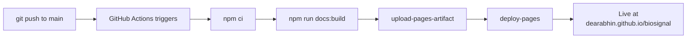

# Deployment Guide

This site is built with **VitePress** and deploys automatically to **GitHub Pages** via **GitHub Actions** — the same workflow as [blog.abhinkrishna.com](https://blog.abhinkrishna.com). Follow this to run it locally and ship it.

## 0. Prerequisites

- [Node.js](https://nodejs.org/) **v20+** (`node --version` to check)
- [Git](https://git-scm.com/)
- A GitHub account

## 1. Project Structure

```text
biosignal/
├── .github/workflows/deploy.yml   # CI/CD: build + deploy on push to main
├── .gitignore
├── package.json                   # scripts + VitePress/Mermaid/MathJax deps
├── README.md
└── doc/
    ├── .vitepress/
    │   ├── config.mts             # site config, nav, sidebar, math + mermaid
    │   └── theme/
    │       ├── index.js           # theme overrides (Mermaid viewer, etc.)
    │       └── style.css          # the blog's visual identity
    ├── public/                    # static assets (favicon, CNAME)
    ├── index.md                   # homepage (hero + card grid)
    ├── getting-started.md
    ├── resources.md
    ├── deployment-guide.md
    ├── modules/
    │   ├── module-1.md … module-4.md
    └── projects/
        ├── capstone-projects.md
        └── portfolio-guide.md
```

## 2. Run Locally

```bash
# Clone (or just cd into your local folder)
git clone https://github.com/dearabhin/biosignal.git
cd biosignal

# Install dependencies
npm install

# Start the dev server (hot-reload at http://localhost:5173)
npm run docs:dev
```

| Command | What it does |
| :--- | :--- |
| `npm run docs:dev` | Local dev server with hot reload |
| `npm run docs:build` | Production build → `doc/.vitepress/dist` |
| `npm run docs:preview` | Serve the production build locally |

::: tip First-run check
Open `http://localhost:5173`. You should see the hero and card grid. Click into Module 1 — confirm the **math renders** (the `$...$` equations) and the **Mermaid diagrams draw**. If math shows as raw `$` text, see [Troubleshooting](#_7-troubleshooting).
:::

## 3. Key Configuration (`doc/.vitepress/config.mts`)

Two settings control where the site lives. **Set these before deploying:**

```ts
const SITE_URL = 'https://dearabhin.github.io/biosignal';
const BASE_PATH = '/biosignal/';   // <-- must match your repo name!
```

- **Deploying to `https://<user>.github.io/<repo>/`** (project page, the default): `BASE_PATH` must be `'/<repo>/'` with leading and trailing slashes. For this repo: `'/biosignal/'`.
- **Deploying to a custom domain or `<user>.github.io`** (root): set `BASE_PATH = '/'` and `SITE_URL` to your domain.

::: warning The #1 GitHub Pages mistake
If your CSS/JS 404s and the deployed site looks unstyled, `BASE_PATH` doesn't match your repo name. A project site served from `/biosignal/` **must** have `base: '/biosignal/'`. This is the single most common VitePress-on-Pages bug.
:::

Math and Mermaid are already enabled in the config:

```ts
markdown: { math: true },   // KaTeX/MathJax via markdown-it-mathjax3
// withMermaid(...) wraps the whole config for diagram support
```

## 4. Deploy with GitHub Actions (CI/CD)

The workflow at `.github/workflows/deploy.yml` builds and deploys on every push to `main`. No manual steps after setup.

**One-time setup:**

1. **Create the repo and push:**
   ```bash
   git init
   git add .
   git commit -m "Initial commit: biosignal course site"
   git branch -M main
   git remote add origin https://github.com/dearabhin/biosignal.git
   git push -u origin main
   ```

2. **Enable Pages with Actions as the source:**
   GitHub repo → **Settings → Pages → Build and deployment → Source: GitHub Actions**.

3. **Watch it build:** the **Actions** tab shows the workflow. On success your site is live at `https://dearabhin.github.io/biosignal/`.



The workflow (already in your repo):

```yaml
name: Deploy docs to GitHub Pages
on:
  push: { branches: [main] }
  workflow_dispatch:
permissions: { contents: read, pages: write, id-token: write }
concurrency: { group: pages, cancel-in-progress: false }
jobs:
  build:
    runs-on: ubuntu-latest
    steps:
      - uses: actions/checkout@v4
        with: { fetch-depth: 0 }
      - uses: actions/setup-node@v4
        with: { node-version: 20, cache: npm }
      - uses: actions/configure-pages@v4
      - run: npm ci
      - run: npm run docs:build
      - uses: actions/upload-pages-artifact@v3
        with: { path: doc/.vitepress/dist }
  deploy:
    needs: build
    runs-on: ubuntu-latest
    environment: { name: github-pages, url: '${{ steps.deployment.outputs.page_url }}' }
    steps:
      - id: deployment
        uses: actions/deploy-pages@v4
```

## 5. Custom Domain (Optional)

To serve at e.g. `biosignal.abhinkrishna.com` (mirroring your blog's Cloudflare-DNS setup):

1. **Create `doc/public/CNAME`** containing exactly your domain:
   ```text
   biosignal.abhinkrishna.com
   ```
   (Files in `doc/public/` are copied to the site root at build time.)

2. **DNS** (at Cloudflare, where you manage `abhinkrishna.com`): add a **CNAME** record
   `biosignal` → `dearabhin.github.io`. Set it to **DNS-only** (grey cloud) initially so GitHub can issue the TLS certificate; you can enable proxying later.

3. **Update the config** for root serving:
   ```ts
   const SITE_URL = 'https://biosignal.abhinkrishna.com';
   const BASE_PATH = '/';
   ```

4. **GitHub → Settings → Pages → Custom domain**: enter the domain, wait for the DNS check, then tick **Enforce HTTPS**.

::: tip Why the CNAME file *and* the GitHub setting?
The `CNAME` file in `public/` survives every automated deploy (Actions wipes and rebuilds the site, which would otherwise erase the domain setting). Committing it makes the custom domain permanent. This is exactly how your blog repo does it.
:::

## 6. Day-to-Day Workflow

```bash
# Edit a module, preview live
npm run docs:dev

# Happy? Ship it.
git add .
git commit -m "Module 4: add adaptive filter section"
git push        # Actions rebuilds and redeploys automatically (~1-2 min)
```

That's the whole loop: **edit → preview → push → live.**

## 7. Troubleshooting

| Symptom | Cause | Fix |
| :--- | :--- | :--- |
| Deployed site unstyled, assets 404 | `BASE_PATH` ≠ repo name | Set `base: '/biosignal/'` in `config.mts` |
| Math shows as raw `$...$` | `markdown.math` off or dep missing | Ensure `math: true` and `markdown-it-mathjax3` installed |
| Mermaid diagrams don't render | Config not wrapped in `withMermaid` | Keep the `withMermaid(defineConfig({...}))` wrapper |
| Actions build fails on `npm ci` | No `package-lock.json` committed | Run `npm install` once and commit the lockfile |
| Custom domain reverts after deploy | `CNAME` not in `public/` | Put `CNAME` in `doc/public/`, commit it |
| Build OK locally, fails in CI | Node version mismatch | Workflow pins Node 20 — match it locally |

## 8. Performance & Polish (Optional)

- **Sitemap** is auto-generated (`sitemap.hostname` in config) → submit to Google Search Console.
- **Open Graph / Twitter cards** are wired up in `config.mts` `transformHead` → add an `og-image.png` to `public/` for rich link previews.
- **Local search** is built in (the search bar) — no external service needed.
- Run `npm run docs:build` before pushing to catch broken links/build errors locally (faster than waiting on CI).

---

Your site is now a self-updating, professionally-deployed knowledge base — the same infrastructure as your blog, ready to grow with every module and project. Push, and it's live.

→ Back to [Home](/) · [Resources](/resources)
