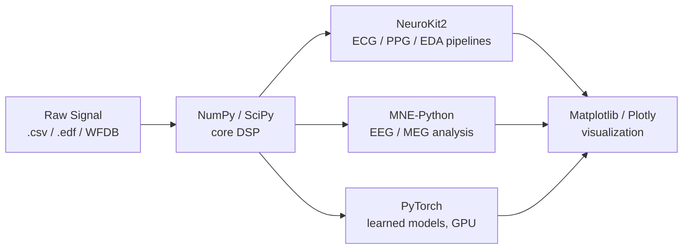

# Getting Started — My Biosignal Lab Setup

Before touching a single equation, I set up a reproducible environment. Top labs care deeply about this: a Neuralink or DeepMind engineer's first instinct when reading your repo is *"can I run this in five minutes?"* If the answer is yes, you're already ahead of 90% of student projects.

## The Software Stack



### One-Command Environment

I use [`uv`](https://docs.astral.sh/uv/) (fast, modern) but plain `venv + pip` works identically:

```bash
# Create and activate an isolated environment
python -m venv .venv
source .venv/bin/activate        # Windows: .venv\Scripts\activate

# The full course stack
pip install numpy scipy matplotlib jupyter \
            neurokit2 mne wfdb \
            plotly pandas torch
```

What each library is for:

| Library | Role in this course |
| :--- | :--- |
| **NumPy** | Arrays, convolution, FFT — the language everything else speaks |
| **SciPy** (`scipy.signal`) | Filter design (`butter`, `firwin`, `bilinear`), `lfilter`, `welch`, `freqz` |
| **Matplotlib** | Every plot on this site |
| **WFDB** | Reading PhysioNet records (MIT-BIH Arrhythmia, etc.) |
| **NeuroKit2** | Production-quality ECG/PPG/EDA pipelines — great for validating my own implementations |
| **MNE-Python** | The research standard for EEG. Used at Meta Reality Labs, CTRL-labs lineage, and hundreds of neuro labs |
| **PyTorch** | Module 4 extensions: learned filters, arrhythmia classifiers, GPU acceleration |

::: tip Why implement things twice?
My rule for this course: **first implement the algorithm from scratch in NumPy (for understanding + exams), then validate against the library version (for correctness).** A Pan-Tompkins QRS detector I wrote myself *and* benchmarked against NeuroKit2 is a far stronger portfolio piece than either alone.
:::

## Datasets I Use Throughout

All free, all standard in the literature — using them means my results are directly comparable to published papers:

| Dataset | Signal | Where it appears |
| :--- | :--- | :--- |
| [MIT-BIH Arrhythmia Database](https://physionet.org/content/mitdb/1.0.0/) | ECG (360 Hz, annotated beats) | Modules 1, 2, 4 + capstone |
| [PhysioNet PTB-XL](https://physionet.org/content/ptb-xl/1.0.3/) | 12-lead clinical ECG | Capstone ML projects |
| [EEG Motor Movement/Imagery](https://physionet.org/content/eegmmidb/1.0.0/) | 64-channel EEG (BCI2000) | Module 2, 3 + BCI capstone |
| [MIT-BIH Noise Stress Test](https://physionet.org/content/nstdb/1.0.0/) | ECG + calibrated noise | Module 4 filtering projects |

```python
# Loading a PhysioNet ECG record in 4 lines
import wfdb

record = wfdb.rdrecord("100", pn_dir="mitdb", sampto=3600)  # 10 s @ 360 Hz
ecg = record.p_signal[:, 0]                                  # lead MLII
fs = record.fs
print(f"Loaded {len(ecg)} samples at {fs} Hz")
```

## Hardware (Optional but Recruiter-Catnip)

The course is fully doable in software. But real, noisy, self-recorded data teaches you things PhysioNet never will — and "built my own acquisition rig" is a phrase that gets interviews.

| Kit | ~Cost (India) | What it gets you |
| :--- | :--- | :--- |
| **AD8232 ECG module + Arduino/ESP32** | ₹300–600 | Single-lead ECG, perfect for Module 1 & 4 projects |
| **MAX30102 PPG sensor** | ₹150–300 | Pulse waveform, dicrotic notch detection project |
| **BioAmp EXG Pill (Upside Down Labs)** | ₹2,500–3,500 | ECG/EMG/EOG/EEG — Indian-made, well documented |
| **OpenBCI Ganglion (4-ch)** | ~₹25,000 | Research-grade EEG; the standard student BCI board |

::: warning Safety first
Anything that touches your body must be **battery-powered and galvanically isolated** while recording. Never record biosignals from a device connected to mains power (including a charging laptop). This is also Lesson Zero of biomedical instrumentation interviews.
:::

## Repository Convention for Every Project

Every project in this course follows the same skeleton (details in the [Portfolio Guide](/projects/portfolio-guide)):

```text
project-name/
├── README.md            # GIF demo at top, then problem → method → results
├── pyproject.toml       # or requirements.txt — pinned versions
├── data/                # .gitignored; download script instead
│   └── download.py
├── src/
│   ├── preprocessing.py
│   ├── detection.py     # the algorithm
│   └── evaluation.py    # metrics vs. annotations
├── notebooks/
│   └── 01_exploration.ipynb
├── tests/
│   └── test_detection.py
└── results/
    └── figures/
```

Now, on to the signals themselves → [Module 1](/modules/module-1).
