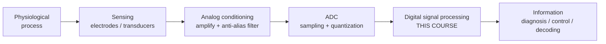
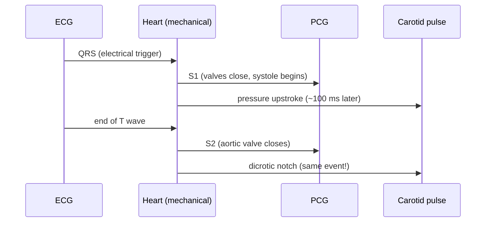

# Module 1 — Basics of Biomedical Signal Processing

> *"The body is a machine that broadcasts its own diagnostics. We just have to learn the protocol."*

In July 2016, researchers at the University of Pittsburgh implanted electrode arrays in Nathan Copeland's motor and sensory cortex. The raw output of those electrodes was just **voltage versus time** — squiggly lines, indistinguishable from noise to the untrained eye. Everything that made the system work — the robotic arm, the restored sense of touch — happened *between* the electrode and the actuator, in signal processing.

This module is where that pipeline begins: what biomedical signals *are*, how we turn continuous body voltages into numbers a computer can handle, and the mathematical machinery (LTI systems, convolution, correlation) that every later module builds on.

**Syllabus coverage:** Introduction & relevance · biomedical signals (ECG, EMG, EEG, PCG, VAG, carotid pulse, speech, concurrent signals) · signal representation · sampling theorem & aliasing · elementary signals · classification of discrete signals (energy/power, periodic/aperiodic, even/odd) · discrete-time systems & properties · LTI systems, impulse response, convolution, correlation, difference equations.

---

## 1. Why Biomedical Signal Processing Exists

Every cell membrane in your body is a tiny battery (~–70 mV at rest). When neurons fire, muscles contract, or the heart beats, ions surge across membranes and the resulting electrical fields propagate all the way to your skin. Biomedical signal processing is the discipline of:

1. **Acquiring** these tiny signals (microvolts to millivolts) without destroying them,
2. **Cleaning** them — the signal you want is usually buried under noise, interference, and *other* body signals,
3. **Extracting information** — a heart rate, a seizure onset, a motor intention,
4. **Deciding or actuating** — alarm, diagnosis, prosthetic command.



::: tip Why this matters for top labs
This block diagram **is** a brain-computer interface. Replace "physiological process" with "motor cortex" and "information" with "cursor velocity" and you have Neuralink's N1 system. The companies differ in sensors and scale; the math in the middle is exactly what this course teaches.
:::

## 2. The Cast of Characters: Biomedical Signals

Each signal below is a different window into the body. Knowing their **amplitude ranges and bandwidths** is non-negotiable — it determines your sampling rate, filter design, and amplifier specs (and it's a guaranteed exam question).

| Signal | What it measures | Amplitude | Bandwidth | Typical $f_s$ |
| :--- | :--- | :--- | :--- | :--- |
| **ECG** (electrocardiogram) | Heart's electrical activity | 0.5–4 mV | 0.05–100 Hz (diagnostic) | 250–1000 Hz |
| **EMG** (electromyogram) | Muscle fiber action potentials | 0.1–5 mV | 20–500 Hz (surface) | 1–2 kHz |
| **EEG** (electroencephalogram) | Cortical population activity | 2–100 **µV** | 0.5–100 Hz | 250–1000 Hz |
| **PCG** (phonocardiogram) | Heart *sounds* (mechanical) | — (acoustic) | 20–1000 Hz | ≥ 2 kHz |
| **VAG** (vibroarthrogram) | Knee-joint vibration during movement | — | 10 Hz–1 kHz | ≥ 2 kHz |
| **Carotid pulse** | Pressure waveform at carotid artery | — | 0–40 Hz | ≥ 100 Hz |
| **Speech** | Vocal tract acoustics | — | 100 Hz–8 kHz | 8–48 kHz |

### ECG — the workhorse

One cardiac cycle produces the famous **P-QRS-T** morphology: P wave (atrial depolarization), QRS complex (ventricular depolarization — the big spike), T wave (ventricular repolarization). Intervals between these waves are clinical gold: the R-R interval gives heart rate; the QT interval predicts dangerous arrhythmias.

### EEG — the BCI signal

Scalp EEG is the spatial average of ~100 million neurons seen through skull and skin — which is why it's in *microvolts* and why its rhythms are described by frequency bands:

| Band | Range | Associated state |
| :--- | :--- | :--- |
| Delta (δ) | 0.5–4 Hz | Deep sleep |
| Theta (θ) | 4–8 Hz | Drowsiness, memory tasks |
| Alpha (α) | 8–13 Hz | Relaxed, eyes closed (blocks on eye opening!) |
| Beta (β) | 13–30 Hz | Active concentration, motor planning |
| Gamma (γ) | > 30 Hz | Binding, high-level cognition |

::: details The story of alpha — and why "eyes-closed" is the classic first BCI demo
Hans Berger recorded the first human EEG in 1924, partly motivated by a (failed) search for telepathy after his sister "sensed" his near-fatal accident. He noticed a strong ~10 Hz oscillation that *vanished when subjects opened their eyes* — alpha blocking. A century later, detecting that same alpha blocking is still the "hello world" of BCI, and it's one of my Module 2 projects.
:::

### EMG — the wearable-interface signal

Surface EMG is the interference pattern of many motor units firing asynchronously — it looks like amplitude-modulated noise. Its **envelope** tracks muscle force. This is the signal behind Meta's neural wristband (from the CTRL-labs acquisition): EMG at the wrist decoded into finger gestures.

### Concurrent signals

Real clinical analysis uses signals **together**: the carotid pulse's *dicrotic notch* marks aortic valve closure, which segments the PCG's second heart sound (S2), which is timed against the ECG's T wave. Multi-modal timing is also the heart of modern wearables (ECG + PPG → pulse transit time → cuffless blood pressure estimation).



## 3. From Continuous to Discrete: Signal Representation

A continuous-time signal $x(t)$ becomes a discrete-time signal by sampling every $T_s$ seconds:

$$x[n] = x(nT_s), \qquad n \in \mathbb{Z}, \qquad f_s = \frac{1}{T_s}$$

Notation convention used everywhere on this site: **round brackets $x(t)$ = continuous**, **square brackets $x[n]$ = discrete**.

### The Sampling Theorem

> **Nyquist–Shannon:** A bandlimited signal containing no frequencies above $f_{max}$ can be perfectly reconstructed from its samples if
> $$f_s > 2 f_{max}$$

The frequency $f_s/2$ is the **Nyquist frequency** — the highest frequency your digital system can represent.

### Aliasing — the unforgivable sin

If a component at $f > f_s/2$ sneaks in, it doesn't disappear — it **masquerades** as a lower frequency:

$$f_{alias} = |f - k f_s| \quad \text{(for the integer } k \text{ that lands it in } [0, f_s/2])$$

Example: sample 50 Hz powerline interference at $f_s = 60$ Hz → it appears at $|50 - 60| = 10$ Hz, right in the EEG alpha band. **Once aliased, no digital filter can undo it** — the information is corrupted forever. That's why every ADC is preceded by an *analog* anti-aliasing low-pass filter.

```python
import numpy as np
import matplotlib.pyplot as plt

# Aliasing demo: a 50 Hz "powerline" tone sampled at 60 Hz looks like 10 Hz
f_true, fs_bad, fs_good = 50, 60, 1000

t_fine = np.arange(0, 0.5, 1 / 10000)       # pseudo-continuous reference
t_bad = np.arange(0, 0.5, 1 / fs_bad)

x_fine = np.sin(2 * np.pi * f_true * t_fine)
x_bad = np.sin(2 * np.pi * f_true * t_bad)
x_alias = np.sin(2 * np.pi * 10 * t_fine)    # the impostor: 10 Hz

plt.figure(figsize=(10, 4))
plt.plot(t_fine, x_fine, alpha=0.3, label="true 50 Hz signal")
plt.plot(t_fine, x_alias, "g--", label="10 Hz alias")
plt.stem(t_bad, x_bad, "r", basefmt=" ", label=f"samples @ {fs_bad} Hz")
plt.legend(); plt.xlabel("time (s)"); plt.title("Aliasing: 50 Hz wearing a 10 Hz mask")
plt.tight_layout(); plt.show()
```

The red samples fall *exactly* on the green 10 Hz curve. Your computer cannot tell the difference — and neither could a downstream seizure detector.

::: tip Why this matters for top labs
Neuralink's N1 samples each channel at ~20 kHz to capture spike waveforms (~7 kHz bandwidth). Apple Watch samples ECG at 512 Hz. Choosing $f_s$ is the **first engineering decision** in any acquisition system: too low → aliasing; too high → wasted power, memory, and bandwidth — which on an implant means heat in brain tissue. Sampling rate is a *power budget* decision, not just a math one.
:::

## 4. Elementary Signals — the LEGO bricks

Every test, derivation, and proof in DSP uses these five:

**Unit impulse (Kronecker delta)** — the most important signal in this course:
$$\delta[n] = \begin{cases} 1, & n = 0 \\ 0, & n \neq 0 \end{cases}$$

**Unit step:**
$$u[n] = \begin{cases} 1, & n \geq 0 \\ 0, & n < 0 \end{cases} \qquad \text{note } \delta[n] = u[n] - u[n-1]$$

**Ramp:** $\;r[n] = n\,u[n]$

**Real exponential:** $\;x[n] = a^n u[n]$ — decays if $|a|<1$, explodes if $|a|>1$ (remember this for ROC/stability in Module 3)

**Complex exponential / sinusoid:**
$$x[n] = e^{j\omega n} = \cos(\omega n) + j \sin(\omega n)$$

where $\omega = 2\pi f / f_s$ is **digital frequency in radians/sample**. Key subtlety: a discrete sinusoid is periodic **only if** $\omega / 2\pi = f/f_s$ is a *rational* number.

**The sifting property** — any signal is a weighted sum of shifted impulses:

$$x[n] = \sum_{k=-\infty}^{\infty} x[k]\,\delta[n-k]$$

This one line is why convolution exists. Hold that thought.

```python
import numpy as np
import matplotlib.pyplot as plt

n = np.arange(-5, 15)
delta = (n == 0).astype(float)
step = (n >= 0).astype(float)
expo = np.where(n >= 0, 0.8 ** n, 0.0)

fig, axes = plt.subplots(1, 3, figsize=(12, 3))
for ax, sig, name in zip(axes, [delta, step, expo],
                         [r"$\delta[n]$", r"$u[n]$", r"$0.8^n u[n]$"]):
    ax.stem(n, sig, basefmt=" ")
    ax.set_title(name); ax.set_xlabel("n")
plt.tight_layout(); plt.show()
```

## 5. Classifying Discrete Signals

### Energy vs. Power signals

$$E = \sum_{n=-\infty}^{\infty} |x[n]|^2 \qquad\qquad P = \lim_{N\to\infty} \frac{1}{2N+1} \sum_{n=-N}^{N} |x[n]|^2$$

- **Energy signal:** $0 < E < \infty$ (then $P = 0$). Example: $0.8^n u[n]$, a single QRS complex, an evoked potential.
- **Power signal:** $0 < P < \infty$ (then $E = \infty$). Example: $\cos(\omega n)$, ongoing EEG rhythms, periodic signals generally.

*Biomedical intuition:* a transient event (one heartbeat, one muscle twitch) is an energy signal; an ongoing rhythm (alpha waves, sustained powerline hum) is a power signal. This distinction returns in Module 3 — energy signals get spectra, power signals get power spectral *densities*.

### Periodic vs. aperiodic

$x[n]$ is periodic with period $N$ (smallest positive integer) if $x[n+N] = x[n] \;\forall n$.

Watch out: $\cos(0.5 n)$ is **aperiodic** because $0.5/2\pi$ is irrational, even though its continuous cousin $\cos(0.5 t)$ is periodic. An ECG is *quasi*-periodic — close enough to exploit, different enough that heart-rate **variability** is itself a vital sign (and a serious research field).

### Even vs. odd

$$x_e[n] = \frac{x[n] + x[-n]}{2}, \qquad x_o[n] = \frac{x[n] - x[-n]}{2}, \qquad x[n] = x_e[n] + x_o[n]$$

Every signal decomposes uniquely into even + odd parts. Payoff in Module 2: even signals have purely real DTFTs, odd signals purely imaginary — symmetry properties that cut FFT computations in half.

```python
def decompose(x, n):
    """Even/odd decomposition; n must be symmetric about 0."""
    x_flip = x[::-1]                # x[-n] when n is symmetric
    return (x + x_flip) / 2, (x - x_flip) / 2

n = np.arange(-8, 9)
x = np.where(n >= 0, 0.8 ** n, 0.0)         # causal exponential
xe, xo = decompose(x, n)
assert np.allclose(x, xe + xo)               # always true
```

## 6. Discrete-Time Systems and Their Properties

A discrete-time system is a mapping $y[n] = \mathcal{T}\{x[n]\}$. Five properties decide everything about how we can analyze it:

| Property | Definition | Test question to ask |
| :--- | :--- | :--- |
| **Linearity** | $\mathcal{T}\{a x_1 + b x_2\} = a\,\mathcal{T}\{x_1\} + b\,\mathcal{T}\{x_2\}$ | Does scaling/adding inputs scale/add outputs? |
| **Time-invariance** | input delay $\Rightarrow$ equal output delay | Does the system behave the same on Monday and Friday? |
| **Causality** | $y[n]$ depends only on $x[k], k \le n$ | Real-time implementable? |
| **Stability (BIBO)** | bounded input $\Rightarrow$ bounded output | Will it blow up? |
| **Memory** | $y[n]$ depends on past/future samples | Static or dynamic? |

Worked classifications (exam staples):

- $y[n] = 2x[n] + 3$: **not linear** (the +3 violates scaling — it's *affine*), time-invariant, causal, stable.
- $y[n] = x[n]\cos(\omega_0 n)$: linear, **not time-invariant** (coefficient depends on $n$), causal, stable.
- $y[n] = x[-n]$ (time reversal): linear, not time-invariant, **not causal**.
- Moving average $y[n] = \frac{1}{M}\sum_{k=0}^{M-1} x[n-k]$: linear, time-invariant, causal, stable — our first real filter.

::: warning Causality is a real-time constraint, not just a definition
A pacemaker deciding *now* whether to pace cannot use future samples. But an offline sleep-study analyzer can — and zero-phase "filtfilt" filtering (Module 4) deliberately uses non-causal processing to avoid phase distortion. Know which world your application lives in.
:::

## 7. LTI Systems, Impulse Response & Convolution

If a system is **Linear and Time-Invariant**, one signal characterizes it completely: the **impulse response**

$$h[n] = \mathcal{T}\{\delta[n]\}$$

Why? Feed in the sifting decomposition $x[n] = \sum_k x[k]\delta[n-k]$. Time-invariance maps each $\delta[n-k] \to h[n-k]$; linearity sums the scaled responses:

$$\boxed{\;y[n] = \sum_{k=-\infty}^{\infty} x[k]\, h[n-k] = x[n] * h[n]\;}$$

This is **convolution** — the single most important equation of the course.

**Mechanics** (the "flip-shift-multiply-sum" ritual): flip $h[k] \to h[-k]$, shift by $n$, multiply with $x[k]$, sum. Output length: $L_x + L_h - 1$.

**Properties:** commutative ($x*h = h*x$), associative (cascade systems → convolve their $h$'s), distributive (parallel systems → add their $h$'s), identity ($x * \delta = x$).

**LTI facts you must know:**
- Causal $\iff h[n] = 0$ for $n < 0$
- BIBO stable $\iff \sum_n |h[n]| < \infty$
- FIR = finite-length $h[n]$ (always stable!); IIR = infinite-length $h[n]$

```python
import numpy as np
import matplotlib.pyplot as plt

def convolve_from_scratch(x, h):
    """Direct implementation of y[n] = sum_k x[k] h[n-k]."""
    Ly = len(x) + len(h) - 1
    y = np.zeros(Ly)
    for n in range(Ly):
        for k in range(len(x)):
            if 0 <= n - k < len(h):
                y[n] += x[k] * h[n - k]
    return y

# Smooth a noisy ECG-like spike train with a 5-point moving average
rng = np.random.default_rng(42)
x = np.zeros(120); x[20] = 1.0; x[60] = 1.0; x[100] = 1.0   # "R peaks"
x += 0.15 * rng.standard_normal(120)                          # noise
h = np.ones(5) / 5                                            # MA filter

y_mine = convolve_from_scratch(x, h)
y_np = np.convolve(x, h)
assert np.allclose(y_mine, y_np)   # my implementation matches NumPy

plt.figure(figsize=(10, 3))
plt.plot(x, alpha=0.5, label="noisy input")
plt.plot(y_np, lw=2, label="moving-average output")
plt.legend(); plt.title("Convolution = every filter you'll ever run")
plt.tight_layout(); plt.show()
```

::: tip GPU corner
That double `for` loop is $O(N M)$. NumPy vectorizes it; Module 2's FFT makes it $O(N \log N)$; and on a GPU, convolution is *the* primitive — cuDNN exists almost entirely to convolve fast. Every CNN layer that reads ECGs at scale (e.g., the Stanford/iRhythm arrhythmia network) is doing exactly this operation, just learned and parallelized.
:::

## 8. Correlation — Convolution's Twin

Cross-correlation measures **similarity vs. lag** (no flip!):

$$r_{xy}[\ell] = \sum_{n=-\infty}^{\infty} x[n]\, y[n-\ell] \qquad\Longleftrightarrow\qquad r_{xy}[\ell] = x[\ell] * y[-\ell]$$

**Autocorrelation** $r_{xx}[\ell]$ correlates a signal with itself: maximum at $\ell = 0$ (where it equals the energy), even-symmetric, and — crucially — **periodic signals have periodic autocorrelation while white noise's autocorrelation collapses to a spike at 0**. That makes autocorrelation a noise-resistant periodicity detector.

**Template matching** — the matched filter idea: to find where a known waveform (a QRS template) occurs inside a long noisy recording, cross-correlate the recording with the template and look for peaks. This is provably the optimal linear detector for a known signal in white Gaussian noise, and it's the conceptual core of spike sorting in neural implants.

```python
import numpy as np
import wfdb
from scipy.signal import correlate

# Find heartbeats by autocorrelation — no peak detector needed
rec = wfdb.rdrecord("100", pn_dir="mitdb", sampto=3600)   # 10 s of MIT-BIH
ecg = rec.p_signal[:, 0] - np.mean(rec.p_signal[:, 0])
fs = rec.fs

r = correlate(ecg, ecg, mode="full")[len(ecg) - 1:]       # lags >= 0
r /= r[0]

# First strong peak after lag 0 = average beat-to-beat interval
search = r[int(0.4 * fs):]                                 # skip < 0.4 s (150 bpm cap)
lag = np.argmax(search) + int(0.4 * fs)
print(f"Estimated RR interval: {lag/fs:.3f} s -> {60*fs/lag:.1f} bpm")
```

Run it: record 100 reports ≈ 0.81 s → ≈ 74 bpm, matching the database annotations. **Heart rate from pure mathematics — no thresholds, no peak-picking.**

## 9. Difference Equations — LTI Systems You Can Ship

Practical LTI systems are written as **linear constant-coefficient difference equations**:

$$\sum_{k=0}^{N} a_k\, y[n-k] = \sum_{k=0}^{M} b_k\, x[n-k]
\quad\Longrightarrow\quad
y[n] = \frac{1}{a_0}\Big(\sum_{k=0}^{M} b_k x[n-k] - \sum_{k=1}^{N} a_k y[n-k]\Big)$$

- **No feedback** ($N = 0$) → FIR. Example: moving average, $y[n] = \frac{1}{5}\sum_{k=0}^{4} x[n-k]$.
- **Feedback** ($N \ge 1$) → IIR. Example: the leaky integrator $y[n] = 0.9\,y[n-1] + x[n]$, whose impulse response $h[n] = 0.9^n u[n]$ never quite dies.

This `(b, a)` coefficient convention is exactly SciPy's API — the bridge from theory to shipped code:

```python
from scipy.signal import lfilter, dimpulse
import numpy as np

# Leaky integrator: y[n] = 0.9 y[n-1] + x[n]   ->  b = [1], a = [1, -0.9]
b, a = [1.0], [1.0, -0.9]

x = np.zeros(30); x[0] = 1.0                  # unit impulse
h = lfilter(b, a, x)                          # impulse response
assert np.allclose(h, 0.9 ** np.arange(30))   # matches theory exactly

# This one-pole smoother is a real-time EMG envelope follower:
# rectify, then leaky-integrate
emg = np.random.default_rng(0).standard_normal(2000) * \
      np.concatenate([np.ones(1000) * 0.2, np.ones(1000)])   # "contraction" at n=1000
envelope = lfilter([1 - 0.99], [1, -0.99], np.abs(emg))
```

Solving difference equations analytically (homogeneous + particular solution) is in the textbook drill set; in Module 3, the Z-transform turns it into algebra.

---

## Key Takeaways

1. Biosignals are tiny (µV–mV), low-frequency, and noise-drenched; their amplitude/bandwidth table drives every design decision downstream.
2. Sample above twice the highest frequency *after* analog anti-alias filtering — aliasing is irreversible.
3. $\delta[n]$ + sifting + LTI = convolution. One impulse response tells you everything about an LTI system.
4. Stability test: $\sum |h[n]| < \infty$. Causality test: $h[n] = 0$ for $n < 0$.
5. Correlation finds *similarity and periodicity*; it pulled a heart rate out of an ECG with three lines of NumPy.
6. Difference equations are how filters exist in code: `scipy.signal.lfilter(b, a, x)`.

## Self-Assessment

1. EEG has useful content up to 100 Hz. The hardware team proposes $f_s = 160$ Hz to save power. What happens to a 90 Hz gamma component? What apparent frequency does it land on? *(Answer: aliases to $|90-160| = 70$ Hz — corrupting the high-beta/gamma region.)*
2. Classify $y[n] = n\,x[n]$: linear? time-invariant? causal? stable?
3. Show that the moving-average filter is BIBO stable using the $\sum|h[n]|$ criterion.
4. An IIR system has $h[n] = (1.05)^n u[n]$. Prove it is unstable, and predict what you'd see if you ran it on real ECG data.
5. Why does autocorrelation suppress additive white noise at non-zero lags? (Hint: what is the autocorrelation of white noise?)
6. Derive the even/odd decomposition of $u[n]$.

## Next Level / Research Extensions

- **Quantization** (not in syllabus, but the other half of the ADC): model quantization as additive noise, derive the 6.02 dB/bit SNR rule, and figure out why neural implants fight over every bit of ADC resolution.
- Read **Rangayyan Ch. 1** for the clinical context of VAG and PCG — the syllabus's least-Googleable signals.
- Implement convolution three ways (loop, vectorized NumPy, `scipy.signal.fftconvolve`) and benchmark — your first taste of the algorithmic speedups in Module 2.
- Paper to skim: Pan & Tompkins (1985), *A Real-Time QRS Detection Algorithm* — you now know every operation in its block diagram except the filters (Module 4 fixes that).

---

## 🛠 Module 1 Project Ideas

### 1. "HeartBeat-Hunter" — Correlation-Based Beat Detector
**Abstract:** Build a QRS detector that uses template cross-correlation instead of thresholds: extract one clean beat as a template, slide it across MIT-BIH records, and detect beats at correlation peaks. Benchmark sensitivity/PPV against the database's expert annotations.
**Skills:** WFDB, correlation, detection metrics, NumPy vectorization. **Difficulty:** ⭐⭐ · ~2 weeks.
**Lab appeal:** Template matching = matched filtering = the entry-level version of spike sorting used in every intracortical BCI.
```text
heartbeat-hunter/
├── src/{template.py, detector.py, metrics.py}
├── notebooks/01_demo.ipynb
└── tests/test_detector.py
```

### 2. "Alias-Buster" — Interactive Sampling Theorem Visualizer
**Abstract:** A small web dashboard (Plotly/Streamlit) where users drag the sampling rate over a synthetic ECG + 50 Hz interference and *watch* aliasing corrupt the signal in time and frequency views. Deploy it publicly as a teaching tool.
**Skills:** Sampling theory, Streamlit/Plotly, science communication. **Difficulty:** ⭐ · ~1 week.
**Lab appeal:** Communication skill made tangible — interactive explainers are portfolio gold and show you *understand* rather than memorize.

### 3. "MyoSwitch" — EMG Envelope Game Controller
**Abstract:** Acquire forearm EMG with a BioAmp/AD8232-class board + ESP32, stream to Python, and use the rectify-and-leaky-integrate envelope (the Module 1 difference equation!) to trigger keypresses — play Chrome's dinosaur game by clenching your fist.
**Skills:** Real hardware acquisition, serial streaming, real-time difference equations, latency measurement. **Difficulty:** ⭐⭐⭐ · ~3–4 weeks.
**Lab appeal:** A wrist-EMG gesture interface is literally Meta Reality Labs' product direction; even a one-channel version demonstrates the full sensor-to-action loop.

### 4. "BioZoo" — A Multi-Signal Atlas Notebook
**Abstract:** One beautiful Jupyter notebook that loads ECG, EEG, EMG, and PPG from PhysioNet, plots each with correct units/scales, computes energy-vs-power classification, autocorrelation, and band content, and narrates the physiology. Publish as a blog post.
**Skills:** WFDB/MNE data wrangling, visualization, technical writing. **Difficulty:** ⭐ · ~1 week.
**Lab appeal:** Shows breadth across modalities — exactly what "biosignal generalist" roles at wearable companies screen for.

### 5. "PulseSync" — Concurrent-Signal Timing Analyzer
**Abstract:** Using a PhysioNet record with simultaneous ECG + carotid pulse/PPG, measure the pulse-arrival-time (R-peak → pulse foot) beat-by-beat via cross-correlation, and study how it varies — the foundation of cuffless blood-pressure estimation.
**Skills:** Multi-channel alignment, correlation, physiological interpretation. **Difficulty:** ⭐⭐⭐ · ~3 weeks. **Publication angle:** PAT variability analysis is an active wearables research topic.

→ Continue to [Module 2 — Fourier Analysis](/modules/module-2)
