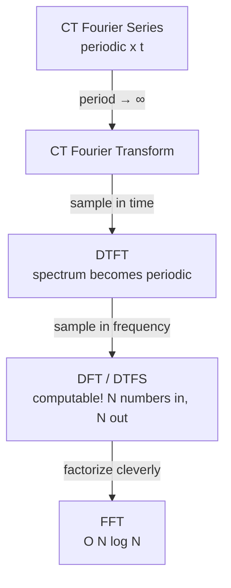
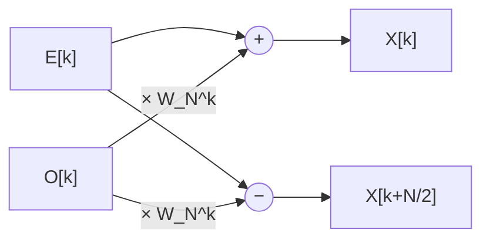

# Module 2 — Fourier Analysis

> *"The FFT is the most important numerical algorithm of our lifetime."* — Gilbert Strang

In 1965, Cooley and Tukey published a fast way to compute the Fourier transform — partly motivated by detecting Soviet nuclear tests from seismic data. (Fun fact: Gauss had the same idea in 1805 and didn't bother publishing.) Today that algorithm runs billions of times per second: in your phone's modem, in MRI reconstruction, in every EEG band-power computation, and inside the spectral feature extractors of BCI decoders.

This module is the frequency-domain toolkit: how *any* signal — including a heartbeat — decomposes into sinusoids, and how to compute that decomposition fast enough for real-time neurotech.

**Syllabus coverage:** Fourier analysis of continuous-time processes · synthesis of an ECG using pure sinusoids · Discrete-Time Fourier Series · DTFT · DFT and properties · FFT — Radix-2, decimation-in-time and decimation-in-frequency.

---

## 1. The Big Idea: Four Transforms, One Family

Time domain ↔ frequency domain comes in four flavors. Memorize this 2×2 map and the whole module organizes itself:

| | **Periodic in time** | **Aperiodic in time** |
| :--- | :--- | :--- |
| **Continuous time** | Fourier **Series** (discrete spectrum) | Fourier **Transform** (continuous spectrum) |
| **Discrete time** | Discrete-Time Fourier **Series / DFT** (discrete, periodic spectrum) | **DTFT** (continuous, periodic spectrum) |

The pattern: **periodic in one domain ⇔ discrete in the other**. Sampling time makes the spectrum periodic; making time periodic makes the spectrum discrete. The DFT — the only one a computer can actually evaluate — is discrete *and* periodic in both domains.



## 2. Continuous-Time Fourier Analysis

A periodic signal $x(t)$ with fundamental $\omega_0 = 2\pi/T$ expands as the **Fourier series**

$$x(t) = \sum_{k=-\infty}^{\infty} c_k\, e^{jk\omega_0 t}, \qquad
c_k = \frac{1}{T}\int_{T} x(t)\, e^{-jk\omega_0 t}\, dt$$

Aperiodic signals get the **Fourier transform** pair:

$$X(\omega) = \int_{-\infty}^{\infty} x(t) e^{-j\omega t} dt, \qquad
x(t) = \frac{1}{2\pi}\int_{-\infty}^{\infty} X(\omega) e^{j\omega t} d\omega$$

The conceptual leap: $X(\omega)$ tells you **how much of each frequency** lives in $x(t)$. Sharp transients (a QRS spike) need *many* high frequencies; smooth slow waves (a T wave) need few.

### Synthesis of an ECG from pure sinusoids ⭐

This is the syllabus's signature exercise, and it's genuinely beautiful: a heartbeat is (quasi-)periodic at the heart rate $f_0$ (e.g. 1.2 Hz ≈ 72 bpm), so it *must* be expressible as a sum of harmonics $f_0, 2f_0, 3f_0, \dots$ The sharp QRS forces significant harmonics out to ~40×$f_0$ — which is exactly *why* diagnostic ECG needs ~100 Hz of bandwidth (Module 1's table, now explained!).

```python
import numpy as np
import matplotlib.pyplot as plt

fs, f0, n_beats = 1000, 1.2, 3                  # 72 bpm
t = np.arange(0, n_beats / f0, 1 / fs)

def ecg_template(tau, T):
    """One synthetic beat on [0, T): Gaussian P, spiky QRS, broad T wave."""
    g = lambda mu, sig, amp: amp * np.exp(-0.5 * ((tau - mu * T) / (sig * T)) ** 2)
    return (g(0.18, 0.025, 0.15)      # P wave
            - g(0.295, 0.008, 0.25)   # Q
            + g(0.31, 0.010, 1.20)    # R
            - g(0.33, 0.010, 0.35)    # S
            + g(0.55, 0.060, 0.30))   # T wave

tau = np.mod(t, 1 / f0)
ecg = ecg_template(tau, 1 / f0)

# Fourier-series coefficients via numerical integration over one period
one_period = ecg[: int(fs / f0)]
N = len(one_period)
k_max = 60
c = np.array([np.mean(one_period * np.exp(-2j * np.pi * k * np.arange(N) / N))
              for k in range(-k_max, k_max + 1)])

def synthesize(num_harmonics):
    ks = np.arange(-num_harmonics, num_harmonics + 1)
    cs = c[k_max + ks]
    return np.real(sum(ck * np.exp(2j * np.pi * k * f0 * t)
                       for k, ck in zip(ks, cs)))

fig, axes = plt.subplots(4, 1, figsize=(10, 8), sharex=True)
for ax, K in zip(axes, [3, 10, 25, 60]):
    ax.plot(t, ecg, alpha=0.3, label="target ECG")
    ax.plot(t, synthesize(K), lw=1.5, label=f"{K} harmonics")
    ax.legend(loc="upper right")
axes[-1].set_xlabel("time (s)")
fig.suptitle("Building a heartbeat out of pure sinusoids")
plt.tight_layout(); plt.show()
```

Watch the progression: 3 harmonics give a vague bump; 10 capture P and T; only by ~25–60 harmonics does the **QRS spike** sharpen. **Sharp time features cost high-frequency budget** — the single most reusable intuition in signal processing. (It also predicts Gibbs ripples near the spike — foreshadowing window design in Module 4.)

::: tip Why this matters for top labs
Hardware teams use exactly this reasoning in reverse: "we need QRS morphology → we need the 40th harmonic of the fastest expected heart rate → amplifier bandwidth and $f_s$ follow." At Neuralink scale: spike waveforms last ~1 ms → kHz-order harmonics → 20 kHz sampling. Spec sheets are frozen Fourier arguments.
:::

## 3. Discrete-Time Fourier Series (DTFS)

For $x[n]$ periodic with period $N$, only $N$ harmonics are distinct (the $N$-th roots of unity), so the sum is finite:

$$x[n] = \sum_{k=0}^{N-1} c_k\, e^{j 2\pi k n / N}, \qquad
c_k = \frac{1}{N} \sum_{n=0}^{N-1} x[n]\, e^{-j 2\pi k n / N}$$

The coefficients $c_k$ are themselves periodic with period $N$. Up to the $1/N$ scaling, **the DTFS is the DFT** — same machine, different costume.

## 4. The DTFT — Discrete Time, Continuous Frequency

For aperiodic $x[n]$:

$$X(e^{j\omega}) = \sum_{n=-\infty}^{\infty} x[n]\, e^{-j\omega n}, \qquad
x[n] = \frac{1}{2\pi} \int_{-\pi}^{\pi} X(e^{j\omega})\, e^{j\omega n}\, d\omega$$

Two facts to internalize:

1. $X(e^{j\omega})$ is **always periodic in $2\pi$** — the spectral fingerprint of sampled signals (and the deep reason aliasing exists: all frequency content must fold into one period $[-\pi, \pi]$).
2. It exists when $\sum|x[n]| < \infty$ — the same condition as BIBO stability, so **every stable LTI system has a frequency response** $H(e^{j\omega})$, and:

$$y[n] = x[n] * h[n] \quad\Longleftrightarrow\quad Y(e^{j\omega}) = X(e^{j\omega})\, H(e^{j\omega})$$

**Convolution becomes multiplication.** Filtering, the laborious flip-shift-sum of Module 1, is just a product in the frequency domain. This is the theorem the entire filter-design module rests on.

Classic worked example: $x[n] = a^n u[n]$, $|a| < 1$:

$$X(e^{j\omega}) = \sum_{n=0}^{\infty} (a e^{-j\omega})^n = \frac{1}{1 - a e^{-j\omega}}$$

— a low-pass response for $0 < a < 1$ (our leaky integrator from Module 1, now seen from the frequency side).

## 5. The DFT — Frequency You Can Compute

The computer can't evaluate a continuous $X(e^{j\omega})$, so we sample it at $N$ equally spaced frequencies $\omega_k = 2\pi k/N$:

$$\boxed{\;X[k] = \sum_{n=0}^{N-1} x[n]\, W_N^{kn}, \qquad
x[n] = \frac{1}{N}\sum_{k=0}^{N-1} X[k]\, W_N^{-kn}, \qquad
W_N \equiv e^{-j2\pi/N}\;}$$

Bin $k$ corresponds to physical frequency

$$f_k = \frac{k\, f_s}{N} \qquad \text{(frequency resolution } \Delta f = f_s/N\text{)}$$

So 10 s of EEG at 250 Hz ($N = 2500$) gives bins every 0.1 Hz — plenty to separate alpha (8–13 Hz) from beta. **Longer windows → finer frequency resolution → blurrier time localization.** That tradeoff is fundamental (it's the signal-processing uncertainty principle) and it dictates the windowing choices in every real-time BCI.

### DFT properties (the exam table, with meaning)

| Property | Statement | Why you care |
| :--- | :--- | :--- |
| Linearity | $a x_1 + b x_2 \leftrightarrow a X_1 + b X_2$ | Superposition of spectra |
| **Circular** time shift | $x[(n-m)_N] \leftrightarrow X[k] W_N^{km}$ | Shifts change phase only, not magnitude |
| Circular convolution | $x_1 \circledast x_2 \leftrightarrow X_1[k] X_2[k]$ | Fast filtering — but mind the "circular"! |
| Conjugate symmetry (real $x$) | $X[N-k] = X^*[k]$ | Only $N/2$ bins are unique → `rfft`, half the work |
| Parseval | $\sum_n \lvert x[n]\rvert^2 = \frac{1}{N}\sum_k \lvert X[k]\rvert^2$ | Energy is preserved → band power is legitimate |
| Duality / time reversal | $x[(-n)_N] \leftrightarrow X[(-k)_N]$ | Symmetry bookkeeping |

::: warning The circular-convolution trap
DFT multiplication gives **circular** convolution: the signal wraps around like Pac-Man. To get the *linear* convolution of Module 1 (lengths $L$ and $M$), zero-pad both to at least $L + M - 1$ before transforming. Forget this and your filtered ECG's first samples get contaminated by its last samples — a bug I'd rather make once in a notebook than ever in a pacemaker.
:::

### Band power: the bread-and-butter EEG computation

```python
import numpy as np

def band_power(x, fs, f_lo, f_hi):
    """Mean power of x in [f_lo, f_hi] Hz via the DFT + Parseval."""
    X = np.fft.rfft(x * np.hanning(len(x)))
    freqs = np.fft.rfftfreq(len(x), 1 / fs)
    psd = (np.abs(X) ** 2) / (fs * np.sum(np.hanning(len(x)) ** 2))
    band = (freqs >= f_lo) & (freqs < f_hi)
    return np.trapezoid(psd[band], freqs[band])

# Demo: synthetic "eyes-closed" EEG = strong 10 Hz alpha + 1/f-ish noise
rng = np.random.default_rng(7)
fs, T = 250, 10
t = np.arange(0, T, 1 / fs)
eeg = 8e-6 * np.sin(2 * np.pi * 10 * t) + 3e-6 * rng.standard_normal(len(t))

alpha = band_power(eeg, fs, 8, 13)
beta = band_power(eeg, fs, 13, 30)
print(f"alpha/beta ratio: {alpha / beta:.1f}")   # >> 1 -> "eyes closed"
```

That ratio — one number derived from the DFT — is the decision variable of the classic alpha-blocking BCI, neurofeedback systems, and drowsiness detectors.

## 6. The FFT — Making the DFT Affordable

The direct DFT costs $N^2$ complex multiplications. For real-time 64-channel EEG that's untenable. The FFT computes the **exact same numbers** in $\frac{N}{2}\log_2 N$ multiplications:

| $N$ | Direct $N^2$ | FFT $\frac{N}{2}\log_2 N$ | Speedup |
| :--- | :--- | :--- | :--- |
| 256 | 65,536 | 1,024 | 64× |
| 1,024 | 1,048,576 | 5,120 | 205× |
| 65,536 | 4.3 × 10⁹ | 524,288 | 8,192× |

### The two tricks

Everything follows from the symmetries of the twiddle factor $W_N = e^{-j2\pi/N}$:

$$W_N^{k + N/2} = -W_N^{k} \;\text{(symmetry)}, \qquad W_N^2 = W_{N/2} \;\text{(periodicity)}$$

### Decimation-in-Time (DIT)

Split $x[n]$ into even and odd samples; each half is an $N/2$-point DFT:

$$X[k] = \underbrace{E[k]}_{\text{DFT of evens}} + W_N^k \underbrace{O[k]}_{\text{DFT of odds}}, \qquad
X[k + N/2] = E[k] - W_N^k O[k]$$

One $N$-point problem → two $N/2$-point problems + $N/2$ multiplies. Recurse $\log_2 N$ times. The two-line combine step is the famous **butterfly**:



- Input order: **bit-reversed** (the even/odd shuffling, applied recursively, sorts indices by reversed binary digits). Output: natural order.
- $N/2$ butterflies per stage × $\log_2 N$ stages, **in-place** (no extra memory) — why it fits on a hearing-aid DSP.

### Decimation-in-Frequency (DIF)

The mirror image: split the *output* $X[k]$ into even/odd bins, which leads to combining the first and second *halves* of the input first, multiplying by $W_N^n$ *after* the add/subtract. Natural-order input, **bit-reversed output**. Same cost. (Exam tip: DIT = twiddle *before* the DFT recombination on the odd branch; DIF = twiddle *after* the subtract.)

### A from-scratch Radix-2 DIT FFT

```python
import numpy as np

def fft_dit(x):
    """Recursive radix-2 decimation-in-time FFT. len(x) must be a power of 2."""
    N = len(x)
    if N == 1:
        return x.astype(complex)
    E = fft_dit(x[0::2])                          # evens
    O = fft_dit(x[1::2])                          # odds
    W = np.exp(-2j * np.pi * np.arange(N // 2) / N)
    return np.concatenate([E + W * O, E - W * O])  # butterflies

x = np.random.default_rng(1).standard_normal(1024)
assert np.allclose(fft_dit(x), np.fft.fft(x))      # bit-for-bit the same math

# Feel the asymptotics
import timeit
def dft_direct(x):
    n = np.arange(len(x))
    return (np.exp(-2j * np.pi * np.outer(n, n) / len(x))) @ x

print("direct:", timeit.timeit(lambda: dft_direct(x), number=3))
print("fft   :", timeit.timeit(lambda: np.fft.fft(x), number=3))
```

On my machine the direct DFT takes ~100 ms and `np.fft.fft` ~10 µs — four orders of magnitude, at $N$ = 1024. *That* gap is what makes real-time spectral BCIs possible.

::: tip GPU corner
`cuFFT` parallelizes the butterflies across thousands of CUDA cores: each FFT stage is an embarrassingly parallel batch of independent 2-point operations, which is why FFT maps so well to GPUs. In PyTorch, `torch.fft.rfft(eeg_batch, dim=-1)` on a GPU computes spectra for a whole batch of EEG epochs at once — the standard first layer of many modern sleep-staging and seizure-detection networks. Knowing *why* it's fast (the butterfly structure) is a genuine interview differentiator.
:::

---

## Key Takeaways

1. Periodic ⇔ discrete across domains; the DFT is the only fully discrete (hence computable) member of the Fourier family.
2. An ECG really is a sum of sinusoids — and its sharp QRS is why it needs ~40 harmonics ≈ 100 Hz bandwidth.
3. DTFT: convolution → multiplication. The license to *design* filters in the frequency domain.
4. DFT bin $k$ ↔ $f = k f_s / N$; resolution $= f_s/N$; real signals need only half the bins.
5. Circular ≠ linear convolution — zero-pad to $L + M - 1$.
6. FFT = butterflies + bit reversal: $O(N^2) \to O(N \log N)$, identical results.

## Self-Assessment

1. A 4-second EEG epoch at 256 Hz: what is $N$, the frequency resolution, and the bin index closest to 10.5 Hz? *(1024; 0.25 Hz; $k = 42$.)*
2. Derive the DTFT of $x[n] = a^n u[n]$ and sketch $|X(e^{j\omega})|$ for $a = 0.9$ vs $a = -0.9$. Which is low-pass?
3. Prove Parseval's relation for the DFT using the orthogonality of $W_N^{kn}$.
4. For $N = 8$ DIT-FFT: how many stages? How many butterflies total? Write the bit-reversed input order. *(3; 12; 0,4,2,6,1,5,3,7.)*
5. You multiply the 256-point DFTs of two length-256 signals and inverse-transform. What did you compute, and how do you fix it to get linear convolution?
6. Why does a real input signal let you skip (almost) half the FFT output? Name the NumPy function that exploits this.

## Next Level / Research Extensions

- **Short-Time Fourier Transform**: slide a window, FFT each frame → the spectrogram. Compute one for an EEG sleep recording and *see* sleep spindles. (This is the bridge to Module 3's spectrum estimation.)
- **Goertzel algorithm**: cheaper than FFT when you need only a few bins (e.g., one SSVEP frequency) — exactly the situation in low-power wearable BCIs.
- Read: Cooley & Tukey (1965) — 4 pages that changed computing; and Heideman, Johnson & Burrus, *Gauss and the History of the FFT*.
- PyTorch exercise: re-implement `fft_dit` with tensors, run on GPU, and find the $N$ where GPU beats CPU (spoiler: batch size matters more than $N$).

---

## 🛠 Module 2 Project Ideas

### 1. "FourierHeart" — ECG Synthesizer & Bandwidth Explorer
**Abstract:** Interactive app that synthesizes an ECG from $K$ harmonics with sliders for heart rate and $K$, displaying time-domain reconstruction error next to the harmonic spectrum. Quantifies "how much bandwidth does a diagnosis need?" by comparing clinical features (QRS amplitude/width) across $K$.
**Skills:** Fourier series, interactive viz (Streamlit), clinical reasoning. **Difficulty:** ⭐⭐ · ~2 weeks.
**Lab appeal:** Demonstrates you can connect math → hardware specs, the core systems-engineering skill.

### 2. "AlphaSwitch" — Eyes-Closed EEG Detector (a real BCI!)
**Abstract:** Detect alpha blocking from PhysioNet EEG (or OpenBCI if available): sliding-window FFT, alpha/beta band-power ratio, threshold with hysteresis → binary "switch" output, evaluated with ROC curves. The minimal viable brain-computer interface.
**Skills:** rFFT, windowing, band power, real-time buffering, classifier evaluation. **Difficulty:** ⭐⭐⭐ · ~3 weeks.
**Lab appeal:** It *is* a BCI — the same architecture (spectral features → decision) as commercial neurofeedback and drowsiness products. Strong demo video material.

### 3. "ButterflyBench" — FFT from Scratch, Profiled to the Metal
**Abstract:** Implement direct DFT, recursive DIT, iterative in-place DIT with bit reversal, and (stretch) a CuPy/PyTorch GPU version; verify against `np.fft` and publish a benchmark report across $N$ with roofline-style analysis.
**Skills:** Algorithms, profiling, NumPy/CUDA, technical writing. **Difficulty:** ⭐⭐⭐ · ~3 weeks.
**Lab appeal:** Exactly the "knows the math *and* the machine" signal that HFT firms, DeepMind, and embedded-DSP teams screen for.

### 4. "SpindleScope" — Sleep Spectrogram Atlas
**Abstract:** Build an STFT spectrogram pipeline over the PhysioNet Sleep-EDF dataset, render per-night hypnogram-aligned spectrograms, and automatically flag sleep-spindle-band (12–14 Hz) power bursts. Compare your flags against expert sleep stages.
**Skills:** STFT, MNE, large-file handling, statistics. **Difficulty:** ⭐⭐⭐ · ~3–4 weeks. **Publication angle:** spindle detection is an active, paper-friendly niche.

### 5. "HumHunter" — Powerline Interference Forensics
**Abstract:** Scan MIT-BIH (and your own AD8232 recordings) for 50/60 Hz contamination: estimate hum amplitude/phase per record via DFT bins, map severity across the database, and demo why a notch filter is needed — the perfect setup for Module 4.
**Skills:** DFT surgery on single bins, batch processing, data storytelling. **Difficulty:** ⭐⭐ · ~1–2 weeks.

→ Continue to [Module 3 — Spectrum Analysis & the Z-Transform](/modules/module-3)
