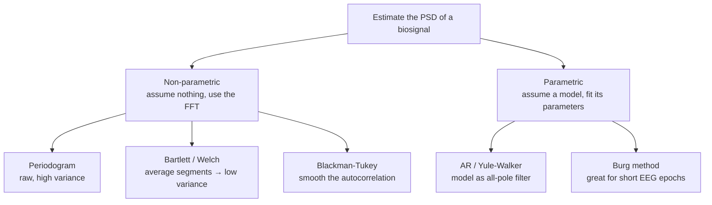
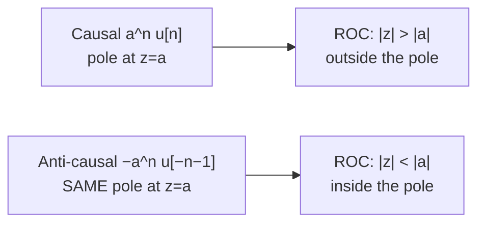

# Module 3 — Spectrum Analysis & the Z-Transform

> *"The Fourier transform tells you what frequencies are present. The Z-transform tells you whether your system will survive them."*

The FFT gives a spectrum, but a raw FFT of a noisy 2-second EEG snippet is a jagged mess — statistically, it's a terrible estimate. This module fixes that (spectrum *estimation*) and then introduces the Z-transform: the tool that turns difference equations into algebra, reveals *why* a filter is stable or unstable through its poles and zeros, and underpins the entire filter-design module that follows.

**Syllabus coverage:** Spectrum analysis of biosignals · parametric vs non-parametric methods · Z-transform, ROC and properties of ROC · Z-transform properties (linearity, time shifting, scaling, time reversal, differentiation, convolution, correlation, multiplication, Parseval, initial value theorem) · rational Z-transforms, poles & zeros · LTI system function · inverse Z-transform by long division, partial fractions, residue, and convolution methods.

---

## 1. Why "Spectrum Estimation" Is Hard

Take the FFT of real EEG and you get a spiky, noisy curve that changes wildly if you grab a slightly different 2 seconds. The problem: the **periodogram** (squared-magnitude FFT) is a *statistically inconsistent* estimator — its variance does **not** shrink as you collect more data; you just get more, equally-noisy spikes. We're estimating a smooth underlying power spectral density (PSD) from one noisy realization, and naively that fails.

Two families of fixes:



## 2. Non-Parametric Methods

These estimate the spectrum directly from data via the FFT — robust, assumption-free, the default for most exploratory work.

### Periodogram → Bartlett → Welch

The **periodogram** of an $N$-point record:

$$\hat{P}_{xx}(f) = \frac{1}{N}\left| \sum_{n=0}^{N-1} x[n]\, e^{-j2\pi f n}\right|^2$$

The cure for its variance is **averaging**. Bartlett's method splits the record into $K$ non-overlapping segments, periodograms each, and averages → variance drops by ~$1/K$ (at the cost of $K\times$ coarser resolution). **Welch's method** improves on it with *overlapping* (typically 50%) **windowed** segments — the workhorse PSD estimator in all of neuroscience:

$$\hat{P}_{xx}^{\text{Welch}}(f) = \frac{1}{K}\sum_{i=1}^{K} \frac{1}{N_{\text{seg}} U}\left| \sum_n w[n]\,x_i[n]\,e^{-j2\pi f n}\right|^2$$

where $w[n]$ is a window (Hann, usually) and $U$ normalizes its power. The bias–variance tradeoff in one knob: longer segments → finer resolution but higher variance; shorter/more segments → smoother but blurrier.

```python
import numpy as np
from scipy.signal import welch, periodogram
import matplotlib.pyplot as plt

rng = np.random.default_rng(0)
fs, T = 250, 30
t = np.arange(0, T, 1 / fs)
# Synthetic EEG: 10 Hz alpha + 20 Hz beta buried in pink-ish noise
eeg = (10e-6 * np.sin(2*np.pi*10*t) + 4e-6 * np.sin(2*np.pi*20*t)
       + 6e-6 * rng.standard_normal(len(t)))

f_p, P_p = periodogram(eeg, fs)                          # raw: spiky
f_w, P_w = welch(eeg, fs, nperseg=fs*2)                  # 2 s Hann segments: clean

plt.figure(figsize=(10, 4))
plt.semilogy(f_p, P_p, alpha=0.4, label="periodogram (high variance)")
plt.semilogy(f_w, P_w, lw=2, label="Welch (averaged)")
plt.xlim(0, 40); plt.axvspan(8, 13, alpha=0.1, color="C2")
plt.xlabel("Hz"); plt.ylabel("PSD (V²/Hz)"); plt.legend()
plt.title("Welch tames the periodogram — alpha & beta peaks emerge")
plt.tight_layout(); plt.show()
```

The Welch curve cleanly shows peaks at 10 and 20 Hz; the periodogram barely hints at them. **This plot is the single most common figure in EEG/BCI papers** — knowing how to produce and defend it is table stakes.

### Blackman–Tukey

Estimate the autocorrelation $\hat r_{xx}[\ell]$, window it (to trust only short, well-estimated lags), then FFT it — using the Wiener–Khinchin theorem that the PSD is the Fourier transform of the autocorrelation. Good for short records.

## 3. Parametric Methods

Non-parametric methods need long records for fine resolution. When data is **short** — a 1-second EEG epoch, a single VAG swing — you can do better by *assuming a model*. The autoregressive (AR) model treats the signal as white noise driven through an all-pole filter:

$$x[n] = -\sum_{k=1}^{p} a_k\, x[n-k] + e[n] \quad\Longrightarrow\quad
\hat{P}_{xx}(f) = \frac{\sigma^2}{\left|1 + \sum_{k=1}^{p} a_k e^{-j2\pi f k}\right|^2}$$

Estimate the $a_k$ (via **Yule–Walker** equations from the autocorrelation, or the **Burg** method) and you get a *smooth*, high-resolution spectrum from little data. Trade-off: you must choose the model order $p$ (too low → over-smoothed; too high → spurious peaks), typically via the AIC or MDL criterion.

| | Non-parametric (Welch) | Parametric (AR/Burg) |
| :--- | :--- | :--- |
| Assumptions | None | Signal fits an AR($p$) model |
| Resolution on short data | Poor | Excellent |
| Risk | High variance | Wrong order → artifacts |
| Biosignal fit | EEG band power, general use | Short EEG epochs, HRV, VAG |

```python
import numpy as np
from spectrum import pburg          # pip install spectrum  (or use statsmodels AR)
# AR/Burg PSD of a short 1-second EEG epoch — resolves peaks Welch would smear
epoch = eeg[: fs]                   # just 1 second
ar = pburg(epoch, order=16, sampling=fs, NFFT=512)
ar.plot()                          # smooth, sharp alpha/beta peaks from 1 s of data
```

::: tip Why this matters for top labs
Real-time BCIs make decisions every ~100–250 ms — far too short for Welch to resolve closely-spaced rhythms. Parametric AR models power the **motor-imagery** decoders (mu/beta desynchronization) behind cursor-control BCIs precisely because they extract sharp spectral features from tiny windows. Knowing *when* to reach for parametric vs non-parametric is a senior-level instinct.
:::

## 4. The Z-Transform

The Z-transform generalizes the DTFT, replacing $e^{j\omega}$ with a general complex variable $z = re^{j\omega}$:

$$X(z) = \sum_{n=-\infty}^{\infty} x[n]\, z^{-n}$$

The extra "knob" $r$ (radius) is what lets the transform converge for signals the DTFT can't handle (like growing exponentials) and what exposes stability. When $r = 1$ (the **unit circle** $z = e^{j\omega}$), the Z-transform *is* the DTFT.

### Region of Convergence (ROC) — the part everyone underrates

$X(z)$ is only meaningful where the sum converges — the **ROC**, a set of $|z|$ values. The same algebraic $X(z)$ can correspond to *different signals* depending on the ROC, so **$X(z)$ is incomplete without it.**

Properties of the ROC (exam essentials):

1. The ROC is an **annulus** (ring) centered at the origin: $r_1 < |z| < r_2$.
2. It contains **no poles** (by definition — the sum diverges there).
3. **Right-sided / causal** signal ($x[n]=0,\,n<0$) → ROC is *outside* the outermost pole: $|z| > r_{\max}$.
4. **Left-sided** signal → ROC is *inside* the innermost pole: $|z| < r_{\min}$.
5. **Two-sided** → a ring between poles (or empty).
6. **Finite-length** → entire plane, except possibly $z=0$ and/or $z=\infty$.



The canonical pair: $a^n u[n] \leftrightarrow \frac{1}{1 - az^{-1}},\ |z|>|a|$ and $-a^n u[-n-1] \leftrightarrow \frac{1}{1-az^{-1}},\ |z|<|a|$ — **identical formula, opposite ROC, completely different signal.** This is the single most tested idea in the module.

### The stability criterion that the whole course was building toward

> **An LTI system is BIBO stable $\iff$ its ROC includes the unit circle $|z| = 1$.**
> For a **causal** system this means **all poles lie strictly inside the unit circle.**

This is the payoff. In Module 1 we tested stability with $\sum|h[n]|<\infty$; now we just *look at a pole plot*. A pole creeping outside the unit circle = a filter about to explode = a patient-monitor alarm screaming garbage.

## 5. Z-Transform Properties

Each property turns a time-domain operation into algebra. (Assume $x[n] \leftrightarrow X(z)$ with ROC $R$.)

| Property | Time domain | Z domain | ROC |
| :--- | :--- | :--- | :--- |
| Linearity | $ax_1 + bx_2$ | $aX_1(z) + bX_2(z)$ | at least $R_1 \cap R_2$ |
| **Time shift** | $x[n-n_0]$ | $z^{-n_0} X(z)$ | $R$ (delay = multiply by $z^{-1}$!) |
| Scaling in z | $a^n x[n]$ | $X(z/a)$ | $\lvert a\rvert R$ |
| Time reversal | $x[-n]$ | $X(1/z)$ | $1/R$ |
| Differentiation | $n\,x[n]$ | $-z\,\dfrac{dX(z)}{dz}$ | $R$ |
| **Convolution** | $x_1 * x_2$ | $X_1(z)\,X_2(z)$ | $\supseteq R_1 \cap R_2$ |
| Correlation | $r_{x_1x_2}[\ell]$ | $X_1(z)X_2(1/z)$ | overlap |
| Multiplication | $x_1[n]x_2[n]$ | complex convolution | — |
| Initial value (causal) | $x[0]$ | $\displaystyle\lim_{z\to\infty} X(z)$ | — |
| Parseval | $\sum x_1[n]x_2^*[n]$ | contour integral of $X_1 X_2^*$ | — |

The two to burn into memory: **time shift → $z^{-n_0}$** (so $z^{-1}$ literally *is* the unit-delay block in every filter diagram) and **convolution → multiplication** (so cascading filters = multiplying system functions).

## 6. Rational Z-Transforms, Poles, Zeros & the System Function

Every practical filter (LTI difference equation) has a **rational** system function — take the Z-transform of $\sum a_k y[n-k] = \sum b_k x[n-k]$ using the time-shift property:

$$H(z) = \frac{Y(z)}{X(z)} = \frac{\sum_{k=0}^{M} b_k z^{-k}}{\sum_{k=0}^{N} a_k z^{-k}}
= \frac{b_0}{a_0}\cdot\frac{\prod_{m=1}^{M}(1 - z_m z^{-1})}{\prod_{k=1}^{N}(1 - p_k z^{-1})}$$

- **Zeros** $z_m$: where $H(z) = 0$ → frequencies the filter *kills* (a notch filter places zeros on the unit circle at 50 Hz).
- **Poles** $p_k$: where $H(z) = \infty$ → frequencies the filter *boosts*; their distance inside the unit circle sets resonance sharpness and decay.

The pole–zero plot is the **DNA of a filter** — you can read off its frequency response, stability, and transient behavior at a glance. (Module 4 is essentially "where do I place poles and zeros to get the response I want?")

```python
import numpy as np
from scipy.signal import tf2zpk, freqz
import matplotlib.pyplot as plt

# A 50 Hz notch filter (fs = 500 Hz): zeros ON the unit circle at ±50 Hz,
# poles just inside at the same angle to keep the notch narrow.
fs, f0, r = 500, 50, 0.95
w0 = 2 * np.pi * f0 / fs
b = np.array([1, -2*np.cos(w0), 1])
a = np.array([1, -2*r*np.cos(w0), r**2])
z, p, k = tf2zpk(b, a)

fig, (ax1, ax2) = plt.subplots(1, 2, figsize=(11, 4))
theta = np.linspace(0, 2*np.pi, 200)
ax1.plot(np.cos(theta), np.sin(theta), "k--", lw=0.8)   # unit circle
ax1.scatter(z.real, z.imag, marker="o", s=90, facecolors="none",
            edgecolors="C0", label="zeros")
ax1.scatter(p.real, p.imag, marker="x", s=90, color="C3", label="poles")
ax1.set_aspect("equal"); ax1.legend(); ax1.set_title("Pole–zero plot")

w, h = freqz(b, a, worN=2048, fs=fs)
ax2.plot(w, 20*np.log10(abs(h) + 1e-12))
ax2.set_xlim(0, fs/2); ax2.set_xlabel("Hz"); ax2.set_ylabel("dB")
ax2.set_title("...and the 50 Hz notch it produces")
plt.tight_layout(); plt.show()
```

The zeros on the unit circle carve a deep null exactly at 50 Hz; the nearby poles keep it surgically narrow so the rest of the ECG survives. **You designed a powerline-hum killer by placing four points on a plane** — and you'll do it for real in Module 4.

## 7. The Inverse Z-Transform — Four Roads Home

Given $H(z)$, recover $h[n]$. Four methods, each with its moment:

### (a) Long division (power-series)
Divide numerator by denominator to read coefficients of $z^{-n}$ directly as $h[n]$. Fast for the *first few* samples; gives no closed form. Example: $\frac{1}{1 - 0.5z^{-1}} = 1 + 0.5z^{-1} + 0.25z^{-2} + \dots \Rightarrow h[n] = 0.5^n u[n]$.

### (b) Partial-fraction expansion (the everyday workhorse)
Break $H(z)$ into a sum of first-order terms $\frac{A_k}{1 - p_k z^{-1}}$, then invert each with the standard pair $\frac{A}{1-p z^{-1}} \leftrightarrow A\,p^n u[n]$ (causal ROC). This is how you get a clean closed-form $h[n]$.

### (c) Residue method
The contour-integral formula $h[n] = \frac{1}{2\pi j}\oint X(z)z^{n-1}dz = \sum \text{Res}$ — equivalent to partial fractions but framed via complex analysis; handy for repeated poles.

### (d) Convolution method
If $X(z) = X_1(z)X_2(z)$ with known inverses, then $x[n] = x_1[n]*x_2[n]$.

```python
import numpy as np
from scipy.signal import residuez, dlti, dimpulse

# H(z) = (1 + 0.5 z^-1) / (1 - 0.5 z^-1)(1 - 0.25 z^-1)  via partial fractions
b = [1, 0.5]
a = np.polymul([1, -0.5], [1, -0.25])           # denominator
r, p, k = residuez(b, a)                          # residues, poles, direct term
print("residues:", r, "\npoles:", p, "\ndirect:", k)
# h[n] = sum_k r_k * p_k^n u[n]  -> closed form

# Sanity-check the first samples against long division (impulse response)
_, h = dimpulse(dlti(b, a), n=6)
print("h[0..5] =", h[0].ravel())
n = np.arange(6)
h_pf = sum(rk * pk**n for rk, pk in zip(r, p)).real
assert np.allclose(h_pf, h[0].ravel())            # partial fractions == truth
```

The two methods agree to floating-point — long division for quick numbers, partial fractions for the formula.

---

## Key Takeaways

1. A raw periodogram is a *bad* (inconsistent) spectrum estimate; **Welch averaging** is the field-standard cure.
2. Parametric **AR/Burg** methods win on short records — the reason real-time BCIs use them.
3. The Z-transform = DTFT with a radius knob; on the unit circle they coincide.
4. **$X(z)$ is meaningless without its ROC**; same formula + different ROC = different signal.
5. **Stability ⇔ ROC includes the unit circle ⇔ (causal) all poles inside it.** Read it off the pole–zero plot.
6. $z^{-1}$ = unit delay; convolution = multiplication; rational $H(z)$ → poles boost, zeros kill.
7. Inverse Z: long division (quick samples), partial fractions (closed form), residues (repeated poles), convolution (factored).

## Self-Assessment

1. You estimate an EEG spectrum two ways: full-record periodogram vs Welch with 2 s segments. Which has finer resolution? Which is more reliable? Why isn't there a free lunch?
2. Find $X(z)$ and *all valid* ROCs for $x[n] = (0.5)^n u[n] + (2)^n u[n]$. Is any choice stable? Causal-and-stable?
3. A causal filter has poles at $0.9e^{\pm j\pi/4}$ and a pole at $1.1$. Stable? What single change makes it stable?
4. Use the time-shift and linearity properties to find $H(z)$ for $y[n] = x[n] - x[n-1] + 0.8\,y[n-1]$. Where are its pole and zero?
5. Invert $X(z) = \frac{z^{-1}}{1 - 1.5z^{-1} + 0.5z^{-2}}$ (causal) by partial fractions.
6. Why do parametric methods risk *spurious* spectral peaks, and how does model-order selection (AIC/MDL) guard against it?

## Next Level / Research Extensions

- **Multitaper spectral estimation** (Thomson's method): averages over orthogonal Slepian tapers instead of segments — superior for short neural data and a favorite in computational neuroscience (Chronux toolbox).
- **Spectrograms of motor imagery**: visualize event-related desynchronization (ERD) in the mu band before movement — the literal feature a cursor-control BCI decodes.
- Connect to ML: an AR model *is* a 1-step linear predictor; modern neural sequence models (and the Hodgkin–Huxley/Izhikevich spike prediction you've blogged about) are its nonlinear descendants.
- Read: Rangayyan Ch. 7 (spectral analysis of biosignals); Kay, *Modern Spectral Estimation* (the bible).

---

## 🛠 Module 3 Project Ideas

### 1. "SpectraBench" — Periodogram vs Welch vs AR Shootout
**Abstract:** A reproducible study comparing non-parametric and parametric PSD estimators on EEG, quantifying resolution and variance as a function of record length, with a clear "which method when" decision guide as the deliverable.
**Skills:** Welch/Bartlett/Burg, Monte-Carlo evaluation, scientific writing. **Difficulty:** ⭐⭐ · ~2 weeks.
**Lab appeal:** Methodological rigor — shows you choose tools by evidence, not habit.

### 2. "PoleDancer" — Interactive Pole–Zero Filter Sandbox
**Abstract:** Drag poles and zeros on the z-plane and watch the frequency response, impulse response, and stability verdict update live (Plotly Dash). The intuition-builder you wish existed while studying.
**Skills:** Z-transform, `tf2zpk`/`freqz`, interactive viz. **Difficulty:** ⭐⭐ · ~2 weeks.
**Lab appeal:** Teaching tool = communication portfolio piece; proves deep conceptual mastery.

### 3. "MuMeter" — Motor-Imagery Band-Power Decoder
**Abstract:** On the PhysioNet EEG Motor Imagery dataset, extract mu/beta band power with short-window AR models over sensorimotor channels and classify left- vs right-hand imagery — a foundational BCI paradigm.
**Skills:** Parametric PSD, feature engineering, classification, cross-validation. **Difficulty:** ⭐⭐⭐⭐ · ~4–5 weeks. **Publication angle:** report subject-wise accuracy; compare AR vs Welch features.

### 4. "StabilityGuard" — Filter Health Linter
**Abstract:** A small library that ingests any `(b, a)` filter, computes poles, and flags instability or marginal stability (poles within ε of the unit circle), with auto-generated pole–zero report cards. Package and publish to PyPI.
**Skills:** Z-domain analysis, software packaging, testing. **Difficulty:** ⭐⭐ · ~1–2 weeks.
**Lab appeal:** Production-engineering mindset applied to DSP — rare and valued.

### 5. "VAGScope" — Knee-Joint Vibration Spectral Signatures
**Abstract:** Apply parametric spectral analysis to vibroarthrogram (VAG) signals to characterize normal vs abnormal cartilage — one of the syllabus's most under-explored, paper-friendly biosignals.
**Skills:** AR modeling, biomedical interpretation, classification. **Difficulty:** ⭐⭐⭐⭐ · ~5 weeks. **Publication angle:** genuinely open research area; data via Rangayyan's group.

→ Continue to [Module 4 — Digital Filters](/modules/module-4)
