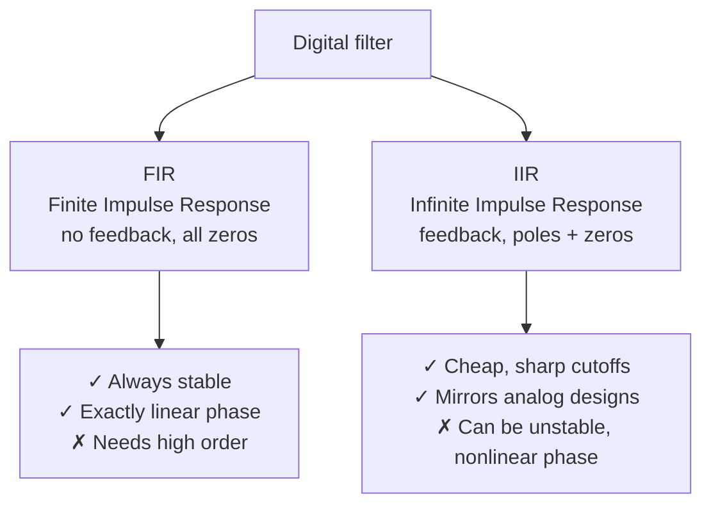
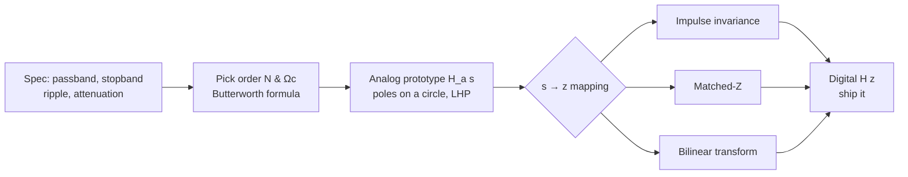

# Module 4 — Digital Filters

> *"A filter is an opinion about which parts of reality matter."*

Everything so far has been preparation. Module 1 gave us LTI systems and convolution; Module 2 gave us frequency-domain thinking; Module 3 gave us poles, zeros, and the stability test. Now we *build* — designing digital filters that strip 50 Hz hum from an ECG, isolate the alpha band from EEG, and extract an EMG envelope without distortion. This is the module whose code ships inside pacemakers, hearing aids, Apple Watches, and the N1 implant.

**Syllabus coverage:** Concept of digital filtering · types of digital filters · comparison with analog filters · FIR design using Fourier series and window functions · IIR design · analog filter approximations — Butterworth · frequency transformation techniques · impulse-invariant transformation · matched-Z transform · bilinear transformation.

---

## 1. What a Digital Filter Is (and Why It Beats Analog)

A digital filter is just an LTI difference equation chosen so its frequency response $H(e^{j\omega})$ passes the bands you want and rejects the rest. We met the machinery already:

$$y[n] = \sum_{k=0}^{M} b_k\, x[n-k] - \sum_{k=1}^{N} a_k\, y[n-k]
\qquad\Longleftrightarrow\qquad
H(z) = \frac{\sum b_k z^{-k}}{\sum a_k z^{-k}}$$

Filtering is **convolution with $h[n]$** (time domain) = **multiplication by $H(e^{j\omega})$** (frequency domain). "Designing a filter" means choosing the $b_k, a_k$ — equivalently, placing poles and zeros (Module 3) — to shape $H(e^{j\omega})$.

### Digital vs analog

| | Analog filter | Digital filter |
| :--- | :--- | :--- |
| Built from | R, L, C, op-amps | Code / arithmetic |
| Repeatability | Drifts with temperature, age, tolerance | Bit-exact, forever |
| Flexibility | Re-solder to change | Change a coefficient array |
| Phase | Hard to make linear | **Perfect linear phase possible (FIR)** |
| Limits | Continuous, no aliasing | Needs anti-alias frontend; finite word length |

The catch every system has: you still need *one* analog anti-aliasing filter before the ADC (Module 1). After that, digital wins on almost everything — which is why modern biomedical instruments are digital-first.

### The two families



The choice has clinical stakes: **linear phase preserves waveform morphology.** If diagnosis depends on the *shape* of the QRS or the ST segment, phase distortion can fake or hide pathology — so ECG morphology pipelines favor FIR (or zero-phase `filtfilt`). When you just need a cheap, steep cutoff and phase doesn't matter, IIR wins.

## 2. FIR Design via Fourier Series + Windows

### The idea

We *want* an ideal frequency response — say a brick-wall low-pass $H_d(e^{j\omega})$. Its inverse DTFT gives the ideal impulse response. For an ideal low-pass with cutoff $\omega_c$:

$$h_d[n] = \frac{\sin(\omega_c n)}{\pi n} = \frac{\omega_c}{\pi}\,\text{sinc}\!\left(\frac{\omega_c n}{\pi}\right)$$

This is the **Fourier-series design method**: the filter taps are literally the Fourier-series coefficients of the desired response. One problem — $h_d[n]$ is **infinite and non-causal** (a sinc stretches to $\pm\infty$). We can't ship that.

### Truncation → Gibbs → windows

The fix: keep only $2M+1$ taps and shift to make it causal. But abrupt truncation (= multiplying by a rectangular window) causes the **Gibbs phenomenon** — persistent ~9% ripples near the cutoff that *never* shrink, they just bunch up (exactly the QRS overshoot we saw synthesizing the ECG in Module 2). The cure: taper the truncation gently with a **window function**:

$$h[n] = h_d[n]\cdot w[n]$$

| Window | Sidelobe atten. | Transition width | Personality |
| :--- | :--- | :--- | :--- |
| Rectangular | −13 dB | Narrowest | Sharpest cutoff, worst ripple |
| Hann | −31 dB | Medium | Good general default |
| Hamming | −41 dB | Medium | Slightly better stopband than Hann |
| Blackman | −58 dB | Widest | Excellent stopband, gentle transition |
| **Kaiser** | **Tunable (β)** | **Tunable** | One knob trades ripple ↔ width; the pro choice |

The universal tradeoff, in one sentence: **narrow transition band ⇔ poor stopband attenuation**, and the window picks your point on that curve. Kaiser's $\beta$ parameter lets you dial it to spec.

```python
import numpy as np
from scipy.signal import firwin, freqz
import matplotlib.pyplot as plt

fs, cutoff, numtaps = 500, 40, 101        # 40 Hz LP for ECG, 101 taps
plt.figure(figsize=(10, 4))
for win in ["boxcar", "hann", "hamming", "blackman"]:
    h = firwin(numtaps, cutoff, fs=fs, window=win)
    w, H = freqz(h, fs=fs, worN=4096)
    plt.plot(w, 20*np.log10(abs(H) + 1e-12), label=win)
plt.axvline(cutoff, color="k", ls="--", lw=0.8)
plt.xlim(0, 120); plt.ylim(-100, 5)
plt.xlabel("Hz"); plt.ylabel("dB"); plt.legend()
plt.title("Same cutoff, four windows — the ripple/width tradeoff made visible")
plt.tight_layout(); plt.show()
```

You'll see rectangular has the steepest edge but ripples buzzing along the stopband at −13 dB; Blackman's stopband is silky (−58 dB) but its transition is lazy. **This single plot is the entire window-design lesson.**

### Why FIR linear phase is "free"

If the taps are **symmetric** ($h[n] = h[M-n]$), the phase response is *exactly* linear — every frequency is delayed by the same $M/2$ samples, so the waveform shape is preserved (just delayed). No analog filter can guarantee this. For morphology-critical ECG work, that's the whole ballgame.

```python
import numpy as np, wfdb
from scipy.signal import firwin, filtfilt

# Practical ECG cleanup: FIR bandpass 0.5–40 Hz (removes baseline wander + HF noise)
rec = wfdb.rdrecord("100", pn_dir="mitdb", sampto=3600)
ecg, fs = rec.p_signal[:, 0], rec.fs
taps = firwin(401, [0.5, 40], pass_zero=False, fs=fs, window="hamming")
ecg_clean = filtfilt(taps, 1.0, ecg)      # filtfilt = zero-phase, no morphology shift
```

## 3. IIR Design via Analog Prototypes

FIR needs hundreds of taps for a sharp cut. IIR achieves the same selectivity with a handful of coefficients by using **feedback (poles)** — and the classic recipe is to design a proven *analog* filter, then transform it to digital.

### The Butterworth approximation

The Butterworth filter is **maximally flat** in the passband — no ripple anywhere, monotonic everywhere. Its magnitude-squared response:

$$|H(j\Omega)|^2 = \frac{1}{1 + \left(\dfrac{\Omega}{\Omega_c}\right)^{2N}}$$

Properties: at $\Omega = \Omega_c$ it's always $-3$ dB; rolls off at $-20N$ dB/decade; flatness costs a wider transition than Chebyshev/elliptic — the price of having no ripple. The poles sit on a circle of radius $\Omega_c$ in the left-half $s$-plane (guaranteeing analog stability), equally spaced — a genuinely elegant result.



## 4. From Analog to Digital: Three Transforms

We have $H_a(s)$; we need $H(z)$. The mapping $s \to z$ matters — get it wrong and you alias or distort.

### (a) Impulse-invariant transformation

Make the digital impulse response a sampled copy of the analog one: $h[n] = T_s\, h_a(nT_s)$. The $s$-plane maps to $z$ via $z = e^{sT_s}$, so each analog pole $s_k$ becomes a digital pole $e^{s_k T_s}$ — **preserving the impulse response shape and the frequency response** (good for matching a known analog filter). **Fatal flaw:** because $z=e^{sT_s}$ is many-to-one in frequency, high frequencies **alias** — so it's usable *only* for low-pass/bandpass filters that are already near-zero above Nyquist. Never for high-pass.

### (b) Matched-Z transform

Directly map each analog pole and zero: $(s - a) \to (1 - e^{aT_s}z^{-1})$. Simple and preserves pole/zero locations, but it ignores any zeros at infinity and can misbehave — more of a quick-and-dirty tool.

### (c) Bilinear transformation — the one you'll actually use

Substitute

$$s = \frac{2}{T_s}\cdot\frac{1 - z^{-1}}{1 + z^{-1}}$$

This maps the **entire** left-half $s$-plane *inside* the unit circle (so stable analog → stable digital, always) and the whole $j\Omega$ axis onto the unit circle **with no aliasing** — its decisive advantage over impulse invariance. The price is **frequency warping**: the frequency axis is squashed nonlinearly,

$$\Omega = \frac{2}{T_s}\tan\!\left(\frac{\omega}{2}\right)$$

Fix it by **pre-warping**: design the analog prototype at the warped frequency so that after the bilinear squish, your cutoff lands exactly where you wanted. `scipy.signal.butter` does pre-warping for you internally.

```python
import numpy as np
from scipy.signal import butter, bilinear, freqz, sosfiltfilt
import matplotlib.pyplot as plt

fs = 500
# Design analog Butterworth, then convert by hand to SEE the bilinear transform
N, fc = 4, 40
b_a, a_a = butter(N, 2*np.pi*fc, analog=True)        # analog prototype
b_d, a_d = bilinear(b_a, a_a, fs=fs)                  # -> digital (no pre-warp)

# The one-liner pros use (pre-warps automatically):
sos = butter(N, fc, fs=fs, output="sos")             # 2nd-order sections = numerically safe

w, H = freqz(b_d, a_d, fs=fs, worN=4096)
plt.figure(figsize=(9, 4))
plt.plot(w, 20*np.log10(abs(H)+1e-12), label="bilinear (manual)")
plt.axvline(fc, color="k", ls="--", lw=0.8); plt.axhline(-3, color="C3", ls=":")
plt.xlim(0, 120); plt.ylim(-80, 5); plt.legend()
plt.xlabel("Hz"); plt.ylabel("dB"); plt.title("4th-order Butterworth LP @ 40 Hz, −3 dB at cutoff")
plt.tight_layout(); plt.show()
```

::: warning Use Second-Order Sections (SOS), not (b, a), for real filters
High-order IIR filters in `(b, a)` transfer-function form are numerically fragile — rounding in the coefficients can shove a pole across the unit circle and blow up an otherwise-stable design. **Always** use `output="sos"` and `sosfilt`/`sosfiltfilt`. This is exactly the kind of production detail that separates coursework from shippable code — and that StabilityGuard-style linters (Module 3 project) catch.
:::

## 5. The Complete Biosignal Filtering Pipeline

Putting it together — a realistic ECG denoising chain that knocks out the three classic artifacts (baseline wander, powerline hum, high-frequency noise):

```python
import numpy as np, wfdb
from scipy.signal import butter, iirnotch, sosfiltfilt, tf2sos, freqz
import matplotlib.pyplot as plt

rec = wfdb.rdrecord("100", pn_dir="mitdb", sampto=3600)
ecg, fs = rec.p_signal[:, 0], rec.fs

# 1) Baseline wander: high-pass 0.5 Hz (respiration/electrode drift)
sos_hp = butter(2, 0.5, "highpass", fs=fs, output="sos")
# 2) Powerline hum: notch at 60 Hz (MIT-BIH is US data)
b_n, a_n = iirnotch(60, Q=30, fs=fs); sos_notch = tf2sos(b_n, a_n)
# 3) High-frequency muscle/EMG noise: low-pass 40 Hz
sos_lp = butter(4, 40, "lowpass", fs=fs, output="sos")

x = ecg.copy()
for sos in (sos_hp, sos_notch, sos_lp):
    x = sosfiltfilt(sos, x)               # zero-phase: morphology preserved

t = np.arange(len(ecg)) / fs
plt.figure(figsize=(11, 4))
plt.plot(t, ecg, alpha=0.4, label="raw")
plt.plot(t, x, lw=1.2, label="filtered (HP 0.5 + notch 60 + LP 40)")
plt.xlim(0, 5); plt.legend(); plt.xlabel("s"); plt.ylabel("mV")
plt.title("A clinical-grade ECG cleanup chain in 15 lines")
plt.tight_layout(); plt.show()
```

This three-stage cascade is, conceptually, what runs inside every commercial ECG device. **This is the project the syllabus's "Filtering for removal of artefacts" topic is asking for** — and you now have it end to end.

::: tip Why this matters for top labs / GPU corner
Neuralink's N1 runs on-chip filtering across 1,024 channels in real time under a tight power/heat budget — fixed-point FIR/IIR on custom silicon, because every milliwatt becomes heat in cortical tissue. The same `sosfiltfilt` math, just hardware-constrained. For offline ML at scale (training an arrhythmia net on PTB-XL's 21,000 ECGs), filtering becomes a GPU batch op: `torchaudio.functional.lfilter` or FFT-domain filtering on the whole tensor at once. Knowing both the embedded *and* the batch-GPU side of the same filter is exactly the range these labs hire for.
:::

## 6. FIR vs IIR — The Decision Table

| Need | Choose | Why |
| :--- | :--- | :--- |
| Preserve ECG/EEG **morphology** | FIR (linear phase) or IIR + `filtfilt` | No phase distortion |
| **Sharp** cutoff, **low** compute/power | IIR (Butterworth/elliptic) | Few coefficients, steep roll-off |
| Guaranteed **stability**, adaptive taps | FIR | No poles → can't blow up |
| Mimic a known **analog** filter | IIR (bilinear/impulse-invariant) | Inherits analog design |
| Real-time on a **microcontroller** | IIR (low order) or short FIR | Fits memory/MIPS budget |

---

## Key Takeaways

1. Digital filters = LTI difference equations whose poles/zeros shape $H(e^{j\omega})$; they beat analog on repeatability, flexibility, and linear phase.
2. **FIR**: taps = windowed Fourier-series coefficients of the ideal response; always stable; can be exactly linear-phase. Window choice = ripple-vs-transition tradeoff (Kaiser tunes it).
3. **Gibbs phenomenon** is why we window instead of hard-truncate.
4. **IIR**: design an analog Butterworth (maximally flat) prototype, then map to digital.
5. **Bilinear transform** is the go-to mapping — no aliasing, stability-preserving — at the cost of frequency warping, fixed by pre-warping. Impulse-invariance aliases; matched-Z is crude.
6. Ship IIR as **SOS**, filter morphology-critical signals with **`filtfilt`/`sosfiltfilt`** (zero phase).

## Self-Assessment

1. Why can an FIR filter have *exactly* linear phase but a Butterworth IIR cannot? What property of the taps guarantees it?
2. You truncate an ideal LP sinc to 51 taps with a rectangular window and see −13 dB stopband ripple. Name two windows that improve it and state what you sacrifice.
3. Design (by hand, then verify with `scipy`) a 2nd-order Butterworth high-pass at 0.5 Hz for baseline-wander removal at $f_s = 250$ Hz. Where are its poles?
4. Explain frequency warping in the bilinear transform. If you want a digital cutoff at exactly 40 Hz, what analog frequency must you pre-warp to?
5. Why does impulse-invariance fail for high-pass filters but bilinear does not?
6. A colleague's 8th-order IIR ECG filter "works in testing but occasionally outputs NaNs." What's the likely cause and the one-line fix?

## Next Level / Research Extensions

- **Adaptive filters** (LMS/RLS): remove an artifact using a *reference* channel — e.g., cancel maternal ECG from fetal ECG, or EOG eye-blinks from EEG. The bridge from fixed DSP to learning systems.
- **Wavelet denoising**: when noise and signal overlap in frequency (so no fixed filter works), wavelets separate them in time-frequency — state of the art for ECG/EEG artifact removal.
- **Learned filters**: a 1-D CNN's first layer *is* a bank of FIR filters with learned taps. Train one on noisy→clean ECG pairs and inspect what it learned (often: a bandpass!). Direct line from this module to deep learning.
- Read: Smith, *The Scientist and Engineer's Guide to DSP* (free, brilliant on windows); Rangayyan Ch. 3 (filtering for artifact removal — maps 1:1 to your PBL project).

---

## 🛠 Module 4 Project Ideas

### 1. "CleanSignal" — Configurable Biosignal Artifact-Removal Toolkit ⭐ (maps directly to the PBL theme)
**Abstract:** A polished, tested Python package that removes baseline wander, powerline hum, and high-frequency noise from ECG/EMG/EEG via a configurable cascade (FIR or IIR, with zero-phase option), benchmarked on the MIT-BIH Noise Stress Test database with SNR-improvement metrics.
**Skills:** FIR/IIR design, SOS, `filtfilt`, packaging, quantitative evaluation. **Difficulty:** ⭐⭐⭐ · ~3–4 weeks.
**Lab appeal:** The artifact-removal pipeline is the universal first stage of *every* biosignal system; a clean, benchmarked, pip-installable one is an instant portfolio centerpiece.
```text
cleansignal/
├── src/cleansignal/{filters.py, cascade.py, metrics.py, io.py}
├── tests/  ├── benchmarks/nstdb_eval.py
└── README.md  (before/after GIF, SNR table)
```

### 2. "WindowLab" — Interactive FIR Window Design Studio
**Abstract:** A dashboard where you pick filter type, cutoff, taps, and window (including Kaiser β) and instantly see impulse response, magnitude/phase response, and pole-zero plot — the tool that makes the ripple/width tradeoff tactile.
**Skills:** `firwin`, `freqz`, Plotly Dash/Streamlit. **Difficulty:** ⭐⭐ · ~2 weeks.
**Lab appeal:** Teaching artifact = communication credibility.

### 3. "NotchMaster" — Powerline Hum Eliminator with Auto-Detection
**Abstract:** Automatically detect whether a recording carries 50 or 60 Hz interference (via DFT bins — reuse Module 2's HumHunter), then apply an optimally-tuned adaptive notch, validated on real AD8232/BioAmp recordings you collect yourself.
**Skills:** Spectral detection, IIR notch design, hardware data collection. **Difficulty:** ⭐⭐⭐ · ~3 weeks.
**Lab appeal:** Self-collected hardware data + adaptive design = a story that stands out in interviews.

### 4. "PanTompkins-Pro" — Classic QRS Detector, Faithfully Reproduced
**Abstract:** Implement the full 1985 Pan–Tompkins pipeline (bandpass → derivative → squaring → moving-window integration → adaptive thresholding) from scratch, every stage a Module 1–4 concept, benchmarked against MIT-BIH annotations and NeuroKit2.
**Skills:** Full filter cascade, real-time logic, detection metrics. **Difficulty:** ⭐⭐⭐⭐ · ~4 weeks. **Publication angle:** reproduce-and-extend (e.g., test robustness under the Noise Stress DB) is genuinely publishable.

### 5. "NeuralFilter" — Learned vs Designed Filters Face-Off
**Abstract:** Train a small 1-D CNN to denoise ECG (noisy→clean pairs) and rigorously compare it against your hand-designed Butterworth cascade on SNR, morphology preservation, and latency — then *interpret* the learned first-layer kernels as filters.
**Skills:** PyTorch, classical DSP baseline, model interpretability, GPU. **Difficulty:** ⭐⭐⭐⭐⭐ · ~5–6 weeks. **Publication/lab angle:** the classic-vs-deep comparison with interpretability is exactly the kind of work DeepMind/Neuralink research engineers do.

→ Explore the full [Capstone Project Ideas](/projects/capstone-projects)
