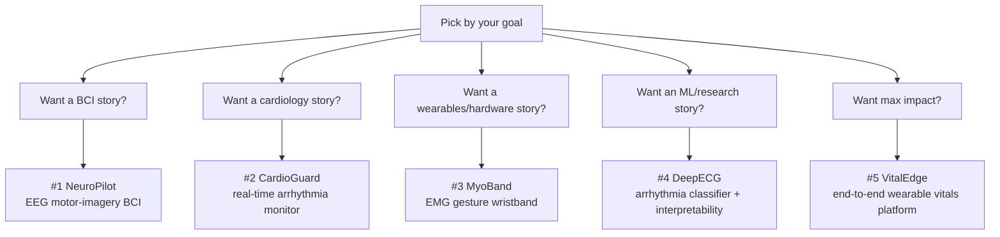

# Capstone Project Ideas

These are bigger than the per-module ideas — semester-scale projects that integrate everything and double as **portfolio centerpieces**. Each is chosen to satisfy the PBL rubric *and* to read well on a Neuralink / Meta Reality Labs / DeepMind application.

::: tip How to read this page
The PBL course rewards: a clear plan, a working implementation benchmarked against ground truth, and a confident presentation (the [30-mark rubric](#mapping-to-the-pbl-rubric) is broken down at the bottom). Every project below is structured to hit all six rubric criteria. Pick **one** as your group's main project; mine the per-module pages for smaller pieces.
:::

## The Selection Map



---

## Project 1 — "NeuroPilot": A Real-Time EEG Motor-Imagery BCI

**Abstract.** Build a brain-computer interface that classifies imagined left- vs right-hand movement from EEG and drives a cursor or robot in real time. Use the PhysioNet Motor Movement/Imagery dataset for development, then (optionally) live EEG from an OpenBCI/BioAmp board. This is the canonical BCI paradigm — the same mu/beta-rhythm desynchronization that powers clinical cursor-control systems.

**Modules integrated.** 1 (sampling, filtering basics) · 2 (FFT band power) · 3 (parametric spectra, ERD) · 4 (bandpass + spatial filtering).

**Tech & skills.** MNE-Python, `scipy.signal`, Common Spatial Patterns, scikit-learn/PyTorch, real-time buffering, Lab Streaming Layer (LSL).

**Difficulty.** ⭐⭐⭐⭐⭐ · **Time.** 6–8 weeks (semester-length).

**Why top labs care.** This *is* the product at neurotech companies. A working motor-imagery decoder — even at 70% accuracy — demonstrates the entire BCI stack: acquisition, filtering, spectral feature extraction, ML decoding, real-time control. Pair it with a clean demo video and it's the strongest possible neurotech portfolio piece.

**Research angle.** Compare CSP+LDA (classical) vs a compact CNN (EEGNet); report subject-wise accuracy and information transfer rate; analyze which channels/bands carry the signal.

```text
neuropilot/
├── README.md                      # demo GIF, architecture diagram, results table
├── pyproject.toml
├── data/download_physionet.py
├── src/neuropilot/
│   ├── preprocessing.py           # bandpass 8–30 Hz, epoching, artifact reject
│   ├── features.py                # CSP, band power (Welch + AR)
│   ├── decoders.py                # LDA, SVM, EEGNet (PyTorch)
│   ├── realtime.py                # LSL inlet -> sliding window -> prediction
│   └── control.py                 # prediction -> cursor/robot command
├── notebooks/{01_explore.ipynb, 02_offline_accuracy.ipynb}
├── tests/
└── results/figures/
```

```python
# Core of the offline decoder — the heart of NeuroPilot
import numpy as np
from mne.decoding import CSP
from sklearn.pipeline import Pipeline
from sklearn.discriminant_analysis import LinearDiscriminantAnalysis
from sklearn.model_selection import cross_val_score

# X: (n_trials, n_channels, n_times) bandpassed 8-30 Hz;  y: 0/1 left/right
clf = Pipeline([("csp", CSP(n_components=6, log=True)),
                ("lda", LinearDiscriminantAnalysis())])
scores = cross_val_score(clf, X, y, cv=5)
print(f"Motor-imagery decoding accuracy: {scores.mean():.1%} ± {scores.std():.1%}")
```

---

## Project 2 — "CardioGuard": Real-Time Arrhythmia Monitor

**Abstract.** A wearable-style pipeline that ingests single-lead ECG, cleans it (Module 4 cascade), detects QRS complexes (Pan–Tompkins), computes heart rate and HRV, and flags abnormal rhythms (ectopic/PVC beats, tachy/brady, irregular R-R) in real time — with a live dashboard and alerting.

**Modules integrated.** All four, end to end. The flagship "everything" project.

**Tech & skills.** WFDB, `scipy.signal`, NeuroKit2 (validation), Plotly Dash/Streamlit dashboard, optional ESP32+AD8232 for live capture.

**Difficulty.** ⭐⭐⭐⭐ · **Time.** 5–6 weeks.

**Why top labs care.** Real-time event detection under noise is the core competency of every wearable health company (Apple, Fitbit, iRhythm). A monitor that works on *your own* recorded ECG, benchmarked against MIT-BIH annotations, shows the full sensor-to-decision loop.

**Research angle.** Benchmark detection sensitivity/PPV against MIT-BIH; characterize failure modes under the Noise Stress Test DB; add a simple AFib detector via R-R interval irregularity (Poincaré plot features).

```text
cardioguard/
├── src/cardioguard/{filtering.py, qrs.py, hrv.py, arrhythmia.py, dashboard.py}
├── firmware/esp32_ad8232/         # optional live acquisition
├── benchmarks/{mitdb_qrs.py, nstdb_robustness.py}
└── results/
```

```python
# QRS detection + HRV in a few lines (validate your from-scratch version against this)
import neurokit2 as nk
signals, info = nk.ecg_process(ecg, sampling_rate=fs)
r_peaks = info["ECG_R_Peaks"]
hrv = nk.hrv_time(r_peaks, sampling_rate=fs)     # SDNN, RMSSD, pNN50...
print(hrv[["HRV_SDNN", "HRV_RMSSD"]])
```

---

## Project 3 — "MyoBand": An EMG Gesture-Recognition Wristband

**Abstract.** Build (or simulate) a multi-channel forearm EMG band that recognizes hand gestures — fist, spread, point, wrist flexion — and maps them to computer commands. The non-invasive interface direction Meta is betting on.

**Modules integrated.** 1 (EMG signals, envelope difference equation) · 2 (spectral features) · 4 (bandpass + envelope filtering).

**Tech & skills.** BioAmp EXG Pill / Myoware + ESP32, serial streaming, feature extraction (RMS, zero-crossings, mean frequency), scikit-learn classifier, real-time inference.

**Difficulty.** ⭐⭐⭐⭐ · **Time.** 5–6 weeks (with hardware).

**Why top labs care.** Surface-EMG gesture decoding is *exactly* Meta Reality Labs' neural-wristband program (ex-CTRL-labs). Even a 4-channel, 4-gesture version demonstrates you understand the signal, the hardware, and the ML — a rare trifecta in a student.

**Research angle.** Study how accuracy degrades with electrode shift / across sessions (the field's hardest open problem); compare time-domain vs frequency-domain feature sets.

```python
# Classic EMG feature vector per window (Hudgins set) — the field standard
import numpy as np
def emg_features(w):
    return np.array([
        np.sqrt(np.mean(w**2)),                       # RMS
        np.sum(np.abs(np.diff(np.sign(w)))) / 2,      # zero crossings
        np.sum(np.abs(np.diff(w))),                   # waveform length
        np.mean(np.abs(w)),                           # mean absolute value
    ])
```

---

## Project 4 — "DeepECG": Arrhythmia Classification with Interpretability

**Abstract.** Train a deep model (1-D CNN / ResNet) to classify ECG rhythms on the large PTB-XL dataset, rigorously compared against a classical feature-engineering baseline, with attention/saliency maps showing *which parts of the beat* the model uses — and a check that those align with clinical reasoning.

**Modules integrated.** 1–4 as preprocessing; the ML is the extension that signals research maturity.

**Tech & skills.** PyTorch, GPU training, PTB-XL, proper train/val/test splits, ROC/AUC, Grad-CAM, model interpretability.

**Difficulty.** ⭐⭐⭐⭐⭐ · **Time.** 6–8 weeks.

**Why top labs care.** This mirrors the landmark Stanford/iRhythm *Nature Medicine* arrhythmia paper. The combination of strong DSP preprocessing, a deep model, an honest classical baseline, and interpretability is precisely a DeepMind/research-engineer portfolio.

**Research angle.** Genuinely publishable as a reproducibility + interpretability study; explore domain shift (train on PTB-XL, test on MIT-BIH).

```python
# A compact, strong ECG classifier backbone (sketch)
import torch.nn as nn
class ECGNet(nn.Module):
    def __init__(self, n_classes, in_ch=1):
        super().__init__()
        def block(i, o, k=7, s=2):
            return nn.Sequential(nn.Conv1d(i, o, k, s, k//2),
                                 nn.BatchNorm1d(o), nn.ReLU(),
                                 nn.MaxPool1d(2))
        self.net = nn.Sequential(block(in_ch, 32), block(32, 64),
                                 block(64, 128), nn.AdaptiveAvgPool1d(1),
                                 nn.Flatten(), nn.Linear(128, n_classes))
    def forward(self, x): return self.net(x)
```

---

## Project 5 — "VitalEdge": End-to-End Wearable Vitals Platform

**Abstract.** The ambitious capstone: a complete wearable system that captures ECG + PPG on an ESP32, streams over BLE/Wi-Fi, runs the full DSP pipeline on-device or edge, computes heart rate, HRV, SpO₂, and cuffless blood-pressure estimate (via pulse transit time), and presents everything on a live web dashboard. A startup prototype, not a homework.

**Modules integrated.** All four + systems engineering + the concurrent-signals timing idea from Module 1.

**Tech & skills.** ESP32 firmware (C/Arduino), AD8232 + MAX30102, BLE, edge DSP, full-stack dashboard, possibly a Cloudflare Workers + D1 backend for storage.

**Difficulty.** ⭐⭐⭐⭐⭐ · **Time.** 8+ weeks / could extend across semesters.

**Why top labs care & startup angle.** This is literally a wearable-neurotech MVP — aligned with your **Seyarkai** ambitions. It shows you can take signals from electrode to cloud to UI, the rarest and most valuable end-to-end capability. Document it well and it's simultaneously a capstone, a portfolio flagship, and a startup demo.

**Research/IP angle.** Cuffless BP via PAT is an active, patent-dense area; even a rough calibration study is compelling.

```text
vitaledge/
├── firmware/esp32/                # acquisition + BLE
├── edge/                          # python DSP service
│   └── src/{ecg.py, ppg.py, fusion.py, pat_bp.py}
├── dashboard/                     # web UI (Vue, matches your blog stack)
├── backend/                       # optional Cloudflare Worker + D1
└── docs/                          # architecture, calibration study
```

---

## Mapping to the PBL Rubric

Your project is graded on 30 marks. Here's how to deliberately earn each block:

| Rubric criterion | Marks | How these projects hit it |
| :--- | :--- | :--- |
| Project Planning & Proposal | 5 | Clear objective + dataset + methodology + milestones — every project above ships with a defined pipeline and benchmark |
| Progress Presentations & Q&A | 4 | Weekly figures (PSD plots, ROC curves) make progress *visible*; know your tradeoffs cold |
| Involvement & Teamwork | 3 | Split by module (acquisition / DSP / ML / dashboard) so each member owns a piece |
| Execution & Implementation | 10 | A working, benchmarked result vs ground truth — the whole point of the structures above |
| Final Presentation | 5 | Demo video (the syllabus explicitly wants a 2–5 min video) + clean slides |
| Quality, Innovation, Creativity | 3 | Self-collected hardware data, an interpretability twist, or a novel comparison sets you apart |

::: tip Choosing for a 5-person group
The syllabus allows groups of up to five. **CardioGuard** and **VitalEdge** split most naturally into 4–5 parallel workstreams (acquisition, filtering, detection, ML/analysis, dashboard) — ideal for distributing the "Involvement & Teamwork" marks while still producing one integrated system.
:::

## A Note on Ambition vs Scope

Pick a project you can get to a *working baseline* in 3 weeks, then spend the rest making it excellent. A QRS detector that runs and is benchmarked beats a half-built BCI every time — for both your grade and your portfolio. Ship the simple version, then climb.

→ Next: [Portfolio & Presentation Guide](/projects/portfolio-guide) — how to turn these into things recruiters notice.
