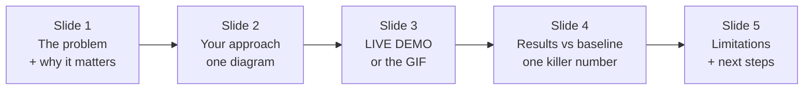
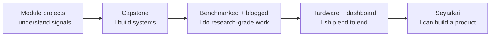

# Portfolio & Presentation Guide

A working project that nobody can understand is worth almost nothing in a recruiting context. This page is how I turn the code from this course into artifacts that get interviews — and into the foundation of a startup. The skills here (communication, documentation, presentation) are explicitly in the PBL rubric *and* they're what actually separates good engineers from hired ones.

## 1. The README Is the Product

When a Neuralink engineer or a DeepMind recruiter opens your repo, the README is the demo. They spend ~30 seconds deciding whether to keep reading. Optimize ruthlessly for that.

**The winning structure:**

```markdown
# ProjectName — one-line value proposition

   <!-- a GIF in the first screenful, always -->

> Detects QRS complexes in single-lead ECG at 99.6% sensitivity on MIT-BIH,
> running in real time on a $4 ESP32.

## Results            <!-- lead with outcomes, not setup -->
| Metric | This work | NeuroKit2 | Pan-Tompkins (1985) |
| ------ | --------- | --------- | ------------------- |
| Sensitivity | 99.6% | 99.5% | 99.3% |

## How it works       <!-- one Mermaid block diagram -->
## Quickstart         <!-- copy-pasteable, runs in <5 min -->
## Method / Approach
## Limitations & future work   <!-- honesty signals maturity -->
```

::: tip The single highest-ROI move
**Put an animated GIF or short video at the very top.** A 5-second clip of your ECG monitor flagging an arrhythmia, or your EMG band moving a cursor, communicates more than 500 words. Record with `asciinema` (terminal), `peek`/ScreenToGif (screen), or your phone (hardware). Recruiters share repos that have a great GIF.
:::

**Non-negotiables that signal "this person ships":**
- Pinned dependencies (`pyproject.toml` / `requirements.txt` with versions)
- A one-command setup that *actually works* on a clean machine (test it in a fresh venv)
- `data/` gitignored with a `download.py` instead of committed datasets
- At least a few `tests/` — even trivial ones say "I think about correctness"
- An honest **Limitations** section — paradoxically, admitting weaknesses builds trust

## 2. Benchmark Against Ground Truth — Always

The difference between a student project and a research artifact is a **number compared to a baseline**. "I built a QRS detector" is a hobby; "my QRS detector hits 99.6% sensitivity on MIT-BIH, matching NeuroKit2, and here's the script that proves it" is a credential.

Every project on this site has a recommended benchmark dataset and metric. Use them — it also makes your results directly comparable to published papers, which is the door to a real publication.

## 3. Turn Each Project Into a Blog Post

You already have [blog.abhinkrishna.com](https://blog.abhinkrishna.com). Each capstone deserves a post following the arc:

1. **The hook** — a story or a striking result ("I pulled a heart rate out of noise with three lines of math")
2. **The problem** — why it's hard, who cares
3. **The approach** — your pipeline, with the Mermaid diagram from your README
4. **The payoff** — results, figures, the GIF
5. **What I learned / what's next**

This compounds: the blog post ranks on Google, gets shared, and demonstrates the *communication* skill labs screen for as hard as the technical one. Cross-link this course site ↔ your blog ↔ your GitHub so they reinforce each other.

## 4. Presenting in PBL Reviews (and Beyond)

The syllabus grades **Progress Presentations (4 marks)** and **Final Presentation (5 marks)**, and wants a **2–5 minute video**. Here's how to nail them.



**Principles that work in a college review *and* a Neuralink interview:**

- **Lead with the result, not the journey.** "Our monitor detects AFib at 94% sensitivity" — *then* explain how. Faculty and recruiters both reward outcome-first.
- **One idea per slide, one diagram beats three paragraphs.** Reuse your Mermaid diagrams.
- **Always show, don't tell.** A live demo (or fallback GIF) is worth ten slides of architecture.
- **Know your one number cold**, and the tradeoff behind it. The killer question is always "why does it fail?" — have the honest answer ready; it's where the marks (and respect) are.
- **Rehearse the 90-second version.** If you can explain your project compellingly in 90 seconds, the 5-minute version is easy and the elevator pitch writes itself.

::: tip The 2–5 minute video (explicit syllabus requirement)
Structure: 15 s problem → 20 s approach → **60–90 s live demo** → 20 s results → 15 s "what's next." Record demo footage first (it's the hard part), narrate over it, add captions for the key numbers. This same video doubles as the GIF source for your README and a LinkedIn post.
:::

## 5. Building the Portfolio Arc

Don't present five disconnected projects — present a **trajectory**. The projects in this course chain into a coherent story:



A recruiter reading top-to-bottom should see: *foundations → integration → rigor → full-stack → entrepreneurship.* That arc — visible across your GitHub, blog, and this site — is far more persuasive than any single project.

## 6. The Startup Lens (Seyarkai)

You've written about [Seyarkai](https://blog.abhinkrishna.com) and wearable neurotech. Several projects here are deliberately startup-adjacent — view them through a product lens:

| Course project | Product direction |
| :--- | :--- |
| CardioGuard | Affordable continuous cardiac monitoring for the Indian market |
| MyoBand | Gesture-control wearable / accessibility input device |
| VitalEdge | Multi-vital wearable platform — the closest to a fundable MVP |
| NeuroPilot | Consumer neurofeedback / focus-training device |

For any of these, the leap from project to product is: (1) a real user with a real pain point, (2) a defensible technical moat (your signal-processing quality), (3) a path to data. Keep a short `PRODUCT.md` in those repos sketching the thesis — investors and labs alike respect engineers who think about *why*, not just *how*.

## 7. The Quiet Habits That Compound

- **Commit small and often** with clear messages — your git history is a work-ethic resume.
- **Write tests as you go**, not at the end. A green CI badge on your README is free credibility.
- **Reproducibility is a feature.** Seed your RNGs, pin versions, script your data download. "It works on my machine" loses jobs.
- **Open-source by default.** Public repos with permissive licenses get found, starred, and cited. Every project on this site is meant to be public.
- **Document while it's fresh.** The 20 minutes you spend writing the README the day you finish saves the project from becoming an unexplainable mystery in three months.

---

The technical mastery from the four modules gets you in the room. *This* page — the documentation, benchmarking, presentation, and storytelling — is what gets you the offer. Treat communication as a first-class engineering skill, because at Neuralink, Meta, and DeepMind, it is.

→ Back to [Capstone Projects](/projects/capstone-projects) · or [Resources & Datasets](/resources)
